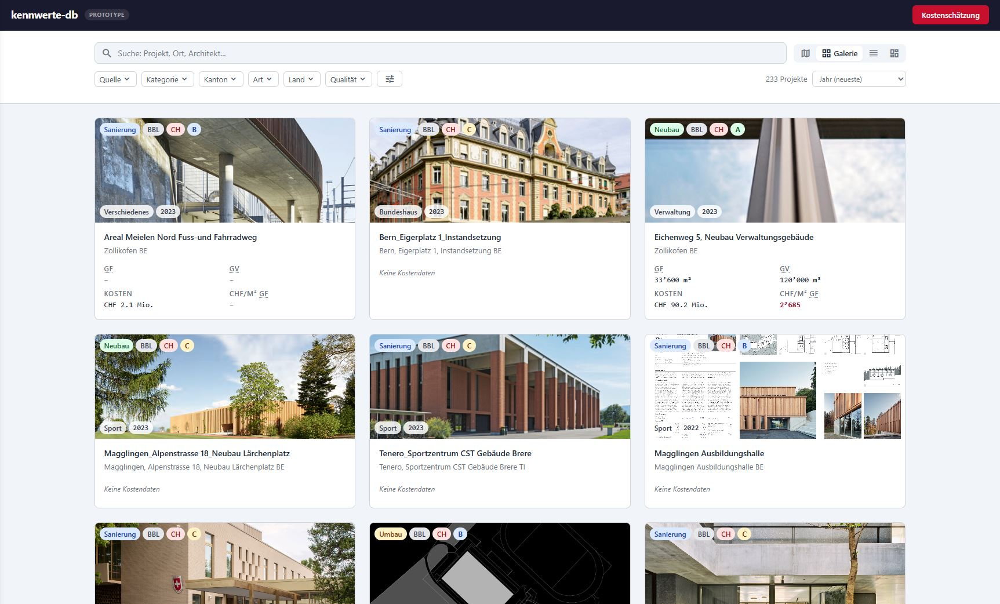
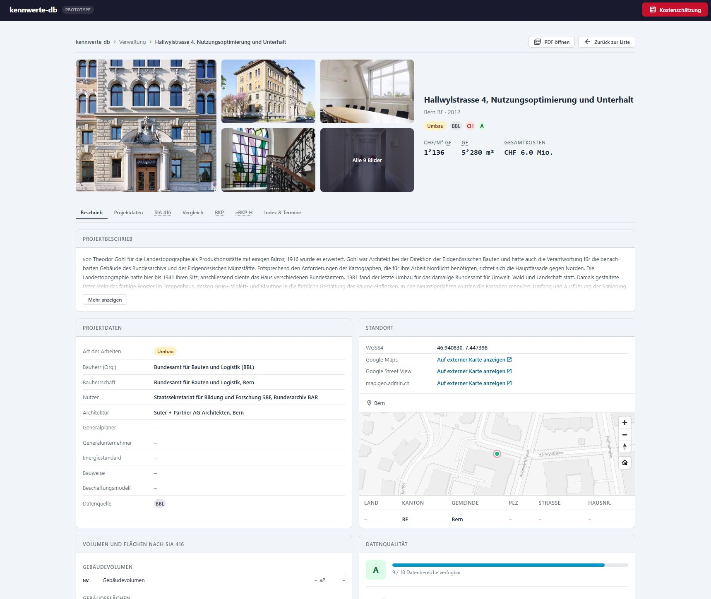

<p align="center">
  
</p>

<h1 align="center">kennwerte-db</h1>

<p align="center">
  <a href="LICENSE"></a>
  
  
  
  
  
</p>

<p align="center">
  Open-source construction cost benchmark database for Swiss public buildings.<br>
  Collects, structures, and presents cost Kennwerte (CHF/m² GF, CHF/m³ GV, BKP/eBKP-H breakdowns)<br>
  from realised projects to support early-stage cost estimation and portfolio-level cost analysis.
</p>

<table>
  <tr>
    <td></td>
    <td></td>
  </tr>
</table>

## Features

- **Gallery, List, Map, Dashboard** — four views for browsing and comparing construction projects
- **Detail view** — SIA 416 volumes/areas, eBKP-H and BKP cost breakdowns, peer comparison box plots, image gallery with lightbox
- **Filters** — by source, category, canton, construction type, country, and data quality grade
- **Cost estimator** — quick benchmark-based estimates using filtered comparison sets
- **Full-text search** across projects, locations, and architects
- Runs entirely in the browser — no server, no build step

## Data Sources

| Source | Type |
|---|---|
| BBL (Bundesamt für Bauten und Logistik) | Federal buildings |
| armasuisse | Defence buildings |
| Stadt Zürich | Municipal buildings |

Data is extracted from publicly available Bautendokumentationen published by Swiss federal, cantonal, and municipal building authorities.

## Tech Stack

- **Frontend** — Vanilla JS, CSS custom properties (design tokens)
- **Database** — SQLite via [sql.js](https://github.com/sql-js/sql.js) (runs in-browser)
- **Maps** — [MapLibre GL JS](https://maplibre.org/)
- **Hosting** — Static files, deployable to GitHub Pages

## Project Structure

```
index.html              Single-page application entry point
css/
  tokens.css            Design tokens (colors, spacing, typography)
  styles.css            Component styles (token-based)
js/
  db.js                 Database loading and queries
  utils.js              Shared state, formatting, tag helpers
  views.js              Gallery, list, map, and dashboard renderers
  detail.js             Detail view, SIA 416, cost tables, carousel, estimator
  main.js               App initialization, routing, filter/search wiring
data/
  kennwerte.db          SQLite database
  pdfs/                 Source PDF documents
scripts/
  extract.py            PDF data extraction pipeline
docs/
  DATAMODEL.md          Entity model and field definitions
  REQUIREMENTS.md       Functional and non-functional requirements
  SOURCES.md            Data source inventory
  PIPELINE.md           Extraction pipeline documentation
```

## License

[MIT](LICENSE) — Digital Real Estate and Support
