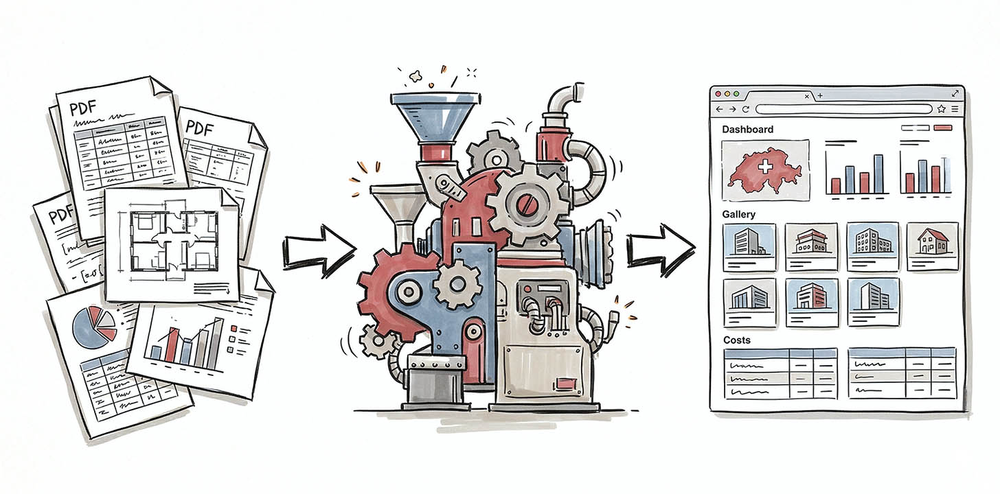
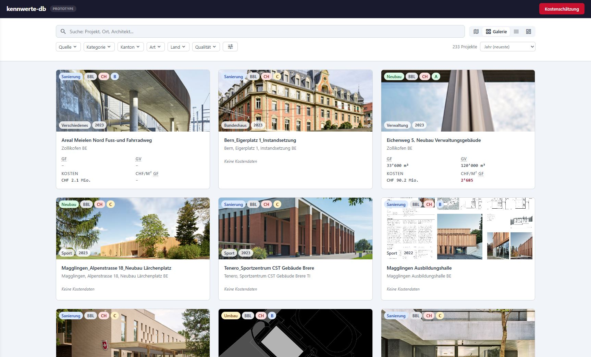
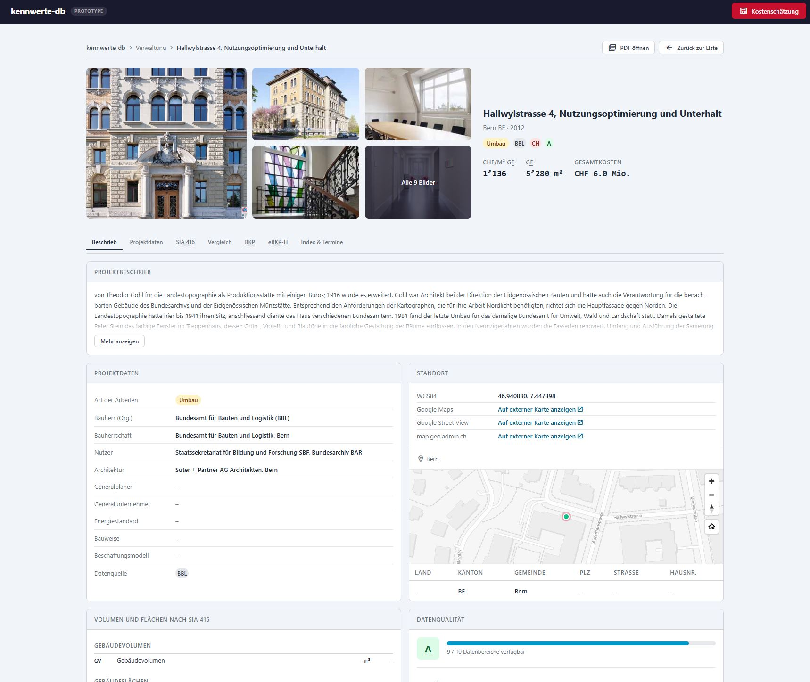

# kennwerte-db

<p align="center">
  <a href="https://bbl-dres.github.io/kennwerte-db/">
    
  </a>
</p>

[](https://bbl-dres.github.io/kennwerte-db/)
[](LICENSE)

> [!CAUTION]
> Unofficial research prototype. Source documents are public, but extracted benchmark data can be incomplete or incorrect and must be verified before use.

Construction-cost benchmark explorer for Swiss public buildings, including area- and volume-based indicators plus BKP and eBKP-H breakdowns.

## Demo

**Live demo:** https://bbl-dres.github.io/kennwerte-db/

<p align="center">
  
  
</p>

## Features

- Browse projects in gallery, list, map, and dashboard views.
- Compare SIA 416 quantities and BKP/eBKP-H cost breakdowns.
- Filter by source, category, canton, construction type, quality, year, and size.
- Explore peer comparisons and cost distributions.
- Estimate costs from a filtered comparison set.
- Search project, location, and architect metadata.

## Run locally

```bash
python -m http.server 8000
```

Open <http://localhost:8000/>.

## Documentation

- [Data sources](docs/SOURCES.md)
- [Extraction pipeline](docs/PIPELINE.md)
- [Data model](docs/DATAMODEL.md)
- [Requirements](docs/REQUIREMENTS.md)

## License

[MIT License](LICENSE). Source documents and third-party tools retain their own terms.
