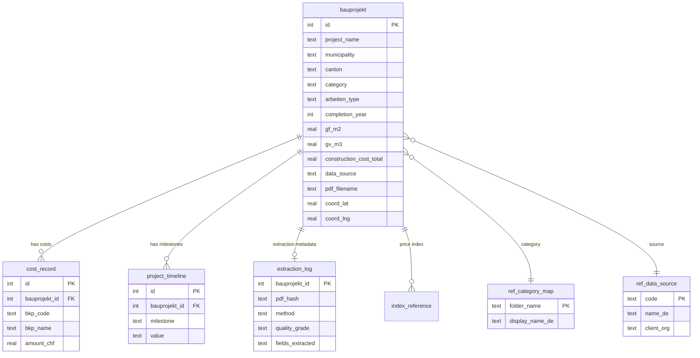
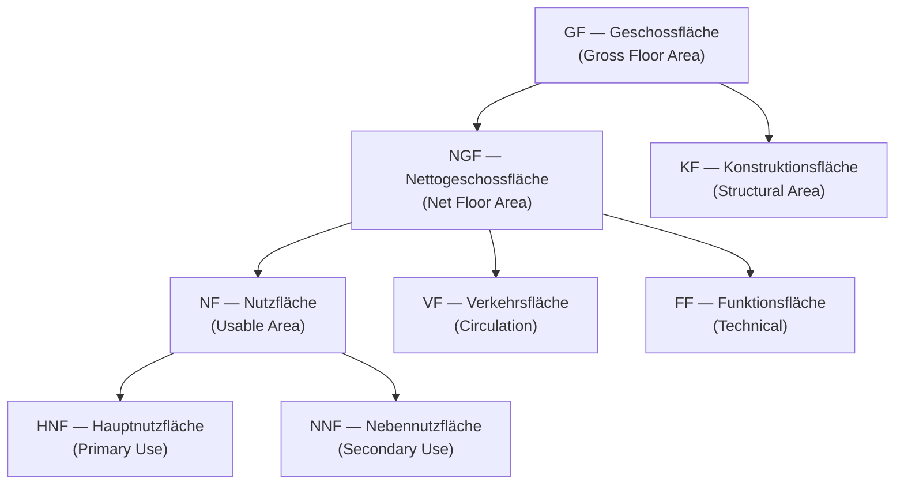

# kennwerte-db — Data Model

## Project Context

**kennwerte-db** is an open-source construction cost benchmark database for Swiss public buildings. It collects, structures, and presents cost Kennwerte (CHF/m² GF, CHF/m³ GV, BKP/eBKP-H breakdowns) from realised Bauprojekte to support early-stage cost estimation and portfolio-level cost analysis.

Data is sourced from publicly available Bautendokumentationen published by Swiss federal, cantonal, and municipal building authorities.

**Related documents**: [REQUIREMENTS.md](REQUIREMENTS.md) · [SOURCES.md](SOURCES.md) · [PIPELINE.md](PIPELINE.md)

---

## Overview

The database centres on **Bauprojekt** (construction project) as the primary entity. Each Bauprojekt has related cost records, timeline milestones, and extraction metadata.

---

## Current Schema (SQLite)

### bauprojekt (373 rows)

The primary entity — one row per construction project extracted from a PDF Bautendokumentation.

#### Identity

| Field | Type | Nullable | Description |
|---|---|---|---|
| **id** | INTEGER | PK | Auto-increment identifier |
| **project_name** | TEXT | NOT NULL | Project name (from filename or PDF text) |
| **pdf_filename** | TEXT | NOT NULL | Source PDF filename |
| **pdf_category_folder** | TEXT | NOT NULL | Category folder in source |
| **data_source** | TEXT | NOT NULL | Source identifier: `bbl`, `armasuisse`, `stadt-zuerich`, `stadt-bern`, `stadt-stgallen`, `kanton-aargau` |
| **source_url** | TEXT | | URL to original document |

#### Location

| Field | Type | Nullable | Description |
|---|---|---|---|
| **municipality** | TEXT | | Municipality name |
| **canton** | TEXT | | Canton (2-letter code: BE, ZH, etc.) |
| **country** | TEXT | | Country (for foreign projects, e.g. "USA") |
| **coord_lat** | REAL | | WGS84 latitude (geocoded) |
| **coord_lng** | REAL | | WGS84 longitude (geocoded) |

#### Classification

| Field | Type | Nullable | Description |
|---|---|---|---|
| **category** | TEXT | NOT NULL | Building category folder name (e.g. `verwaltung`, `sport`, `hochbau`) |
| **sub_portfolio** | TEXT | | Portfolio code (e.g. `ALLG`, `VBS`, `KOMMUN`) |
| **federal_building_type** | TEXT | | Building type code (e.g. `VERW`, `SPORT`, `KASERNE`) |
| **arbeiten_type** | TEXT | | Art der Arbeiten: `NEUBAU`, `UMBAU_SANIERUNG`, `UMBAU`, `UMBAU_ERWEITERUNG`, `ABBRUCH` |

#### Dates

| Field | Type | Nullable | Description |
|---|---|---|---|
| **completion_date** | TEXT | | Completion date (ISO format, from filename) |
| **completion_year** | INTEGER | | Completion year (extracted from date) |

#### SIA 416 Quantities

| Field | Type | Nullable | Description |
|---|---|---|---|
| **gf_m2** | REAL | | Geschossfläche (gross floor area) in m² — primary cost divisor |
| **gv_m3** | REAL | | Gebäudevolumen (building volume) in m³ |
| **ngf_m2** | REAL | | Nettogeschossfläche (net floor area) in m² |

#### Building Characteristics

| Field | Type | Nullable | Description |
|---|---|---|---|
| **floors** | INTEGER | | Number of storeys |
| **workplaces** | INTEGER | | Number of workplaces |
| **energy_standard** | TEXT | | Energy label: `MINERGIE`, `MINERGIE-P`, `MINERGIE-P-ECO`, etc. |

#### Costs

| Field | Type | Nullable | Description |
|---|---|---|---|
| **construction_cost_total** | REAL | | Total construction cost in CHF (usually BKP 2 or Anlagekosten) |

#### Involved Parties

| Field | Type | Nullable | Description |
|---|---|---|---|
| **client_name** | TEXT | | Client / Bauherrschaft name |
| **client_org** | TEXT | | Client organisation (from source lookup) |
| **user_org** | TEXT | | Building user organisation |
| **architect** | TEXT | | Architecture firm |
| **general_planner** | TEXT | | General planner |
| **general_contractor** | TEXT | | General contractor |

#### Content

| Field | Type | Nullable | Description |
|---|---|---|---|
| **project_description** | TEXT | | Free-text project description (up to 2000 chars) |
| **thumbnail_path** | TEXT | | Path to page-1 thumbnail image |

#### Computed Fields (in SQL queries, not stored)

| Field | Formula | Description |
|---|---|---|
| **chf_per_m2_gf** | `construction_cost_total / gf_m2` | Cost per m² GF — primary benchmark |
| **chf_per_m3_gv** | `construction_cost_total / gv_m3` | Cost per m³ GV — secondary benchmark |

---

### cost_record (1,894 rows)

Individual BKP or eBKP-H cost line items for a project. One project may have 5-15 cost records.

| Field | Type | Nullable | Description |
|---|---|---|---|
| **id** | INTEGER | PK | Auto-increment |
| **bauprojekt_id** | INTEGER | NOT NULL, FK | Reference to bauprojekt |
| **bkp_code** | TEXT | NOT NULL | BKP code: `1`-`9` (1-digit), `20`-`29` (2-digit), or `A`-`Z` (eBKP-H) |
| **bkp_name** | TEXT | | Cost category name (e.g. "Gebäude", "Konstruktion Gebäude") |
| **amount_chf** | REAL | | Amount in CHF |

#### BKP Codes (Baukostenplan)

| Code | Name |
|---|---|
| 1 | Vorbereitungsarbeiten |
| 2 | Gebäude |
| 3 | Betriebseinrichtungen |
| 4 | Umgebung |
| 5 | Baunebenkosten |
| 6 | Reserve / Unvorhergesehenes |
| 7 | Generalunternehmer |
| 8 | Mehrwertsteuer |
| 9 | Ausstattung |
| 20-29 | BKP 2 sub-items (Baugrube, Rohbau, Elektro, HLKK, etc.) |

#### eBKP-H Codes (Elementbasierter Baukostenplan Hochbau)

| Code | Name | Reference |
|---|---|---|
| A | Grundstück | GSF |
| B | Vorbereitung | GSF |
| C | Konstruktion Gebäude | GF |
| D | Technik Gebäude | GF |
| E | Äussere Wandbekleidung | FAW |
| F | Bedachung Gebäude | FB |
| G | Ausbau Gebäude | GF |
| H | Nutzungsspez. Anlage | NFH |
| I | Umgebung Gebäude | BUF |
| J | Ausstattung Gebäude | NF |
| V | Planungskosten | CHF B-J |
| W | Nebenkosten zu Erstellung | GF |
| Y | Reserve, Teuerung | CHF B-W |
| Z | Mehrwertsteuer | CHF B-Y |

---

### project_timeline (270 rows)

Milestone dates for a project.

| Field | Type | Nullable | Description |
|---|---|---|---|
| **id** | INTEGER | PK | Auto-increment |
| **bauprojekt_id** | INTEGER | NOT NULL, FK | Reference to bauprojekt |
| **milestone** | TEXT | NOT NULL | Milestone key: `planungsbeginn`, `wettbewerb`, `baubeginn`, `bauende`, `bauzeit_monate` |
| **value** | TEXT | | Date value (ISO format where possible, otherwise raw text) |

---

### index_reference (0 rows — not yet populated in v2)

Baupreisindex reference for cost normalisation.

| Field | Type | Nullable | Description |
|---|---|---|---|
| **id** | INTEGER | PK | Auto-increment |
| **bauprojekt_id** | INTEGER | NOT NULL, FK | Reference to bauprojekt |
| **index_name** | TEXT | | Index name (e.g. "Baukostenindex Espace Mittelland") |
| **index_date** | TEXT | | Index date (e.g. "Oktober 2010") |
| **index_value** | REAL | | Index value at recording |
| **basis_date** | TEXT | | Basis date (e.g. "Oktober 2005") |
| **basis_value** | REAL | | Basis value |

---

### extraction_log (384 rows)

Tracks extraction metadata per project for quality monitoring and incremental processing.

| Field | Type | Nullable | Description |
|---|---|---|---|
| **bauprojekt_id** | INTEGER | PK, FK | Reference to bauprojekt |
| **pdf_hash** | TEXT | | SHA-256 hash (first 16 chars) for change detection |
| **extracted_at** | TEXT | | ISO timestamp of last extraction |
| **method** | TEXT | | Extraction method: `markdown`, `pymupdf`, `ocr`, `error` |
| **pages_total** | INTEGER | | Total PDF pages |
| **pages_with_text** | INTEGER | | Pages with selectable text |
| **pages_ocr** | INTEGER | | Pages requiring OCR |
| **text_chars** | INTEGER | | Total extracted characters |
| **images_found** | INTEGER | | Embedded images extracted |
| **thumbnail_path** | TEXT | | Path to thumbnail |
| **quality_grade** | TEXT | | Data quality grade: A/B/C/D/E |
| **fields_extracted** | TEXT | | JSON: extracted fields with values |
| **extraction_error** | TEXT | | Error message for Grade E failures |

#### Quality Grades

| Grade | Criteria |
|---|---|
| **A** | BKP 2 costs + GF + metadata (architect or client) |
| **B** | Costs OR GF + metadata or description |
| **C** | Metadata or description only |
| **D** | No structured data extracted (filename only) |
| **E** | Extraction error (corrupt PDF, processing crash) |

---

### Reference Tables

#### ref_category_map (15 rows)

Maps folder names to display labels and portfolio classifications.

| Field | Type | Description |
|---|---|---|
| **folder_name** | TEXT, PK | Category folder (e.g. `verwaltung`, `sport`) |
| **sub_portfolio** | TEXT | Portfolio code (e.g. `ALLG`, `VBS`) |
| **federal_building_type** | TEXT | Building type code |
| **display_name_de** | TEXT | German display name (e.g. "Verwaltung") |
| **data_source** | TEXT | Default data source |

#### ref_data_source (3 rows)

Registered data sources.

| Field | Type | Description |
|---|---|---|
| **code** | TEXT, PK | Source identifier (e.g. `bbl`) |
| **name_de** | TEXT | Full German name |
| **client_org** | TEXT | Client organisation name |
| **url** | TEXT | Source URL |
| **description** | TEXT | Description |

---

## Data Coverage (April 2026)

| Source | Projects | With Costs | With GF | Cost Records |
|---|---|---|---|---|
| BBL | 144 | 114 | 88 | ~900 |
| Stadt St. Gallen | 78 | 73 | 14 | ~350 |
| Stadt Bern | 55 | 40 | 4 | ~200 |
| armasuisse | 53 | 29 | 7 | ~250 |
| Stadt Zürich | 36 | 0 | 0 | 0 |
| Kanton Aargau | 7 | 4 | 4 | ~30 |
| **Total** | **373** | **260** | **117** | **~1,900** |

---

## Art der Arbeiten

Classification of construction intervention type, aligned with GWR (VGWR Art. 2).

| Code | Label | Description |
|---|---|---|
| `NEUBAU` | Neubau | Complete new construction |
| `UMBAU_SANIERUNG` | Sanierung | Renovation / refurbishment |
| `UMBAU` | Umbau | Interior conversion / adaptation |
| `UMBAU_ERWEITERUNG` | Erweiterung | Building extension |
| `UMBAU_TEILABBRUCH` | Teilabbruch | Partial demolition |
| `ABBRUCH` | Abbruch | Complete demolition |

---

## SIA 416 Quantities

All area and volume measurements follow SIA 416:2003.

| Field | Unit | Formula | Description |
|---|---|---|---|
| **GF** | m² | GF = NGF + KF | Gross floor area — primary cost divisor |
| **GV** | m³ | | Building volume |
| **NGF** | m² | NGF = NF + VF + FF | Net floor area |
| **NF** | m² | NF = HNF + NNF | Usable area |
| **HNF** | m² | | Primary usable area |
| **NNF** | m² | | Secondary usable area |
| **VF** | m² | | Circulation area |
| **FF** | m² | | Technical / services area |
| **KF** | m² | GF - NGF | Structural area |
| **AGF** | m² | | Exterior floor area |
| **GSF** | m² | GSF = GGF + UF | Plot area |
| **GGF** | m² | | Building footprint |
| **FAW** | m² | | Exterior wall area (eBKP-H reference) |
| **FB** | m² | | Roof area (eBKP-H reference) |

**Currently stored in DB**: GF, GV, NGF (on bauprojekt table). Other quantities displayed in the detail view are extracted from the source PDF on-the-fly via the SIA 416 renderer.

---

## Future Extensions

### Planned for v2

- **Baupreisindex integration** — BFS Baupreisindex data for Teuerungsbereinigung (inflation adjustment) of costs to a common reference year
- **Cross-source deduplication** — match projects across sources by location + year + building type
- **LLM-assisted extraction** — for Stadt Zürich prose-heavy PDFs and other difficult formats

### Considered for v3

- **Gebäude entity** — permanent building record linked to GWR (EGID), enabling lifecycle tracking across multiple interventions
- **FM operating costs** (DIN 18960) — annual facility management costs linked to Gebäude
- **Energy performance** — measured consumption data (Verbrauchswerte) vs design values (Bedarfswerte)
- **Verpflichtungskredit tracking** — approved budget vs actual costs (Kreditausschöpfung)
