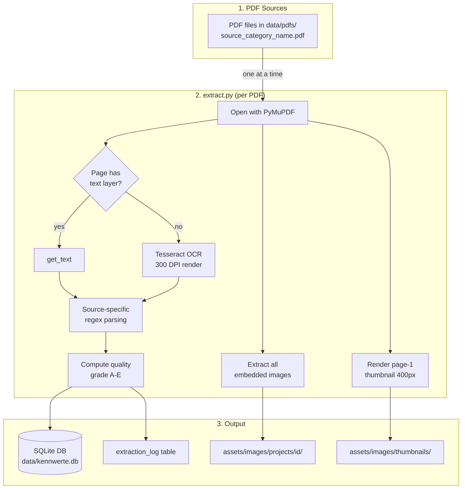
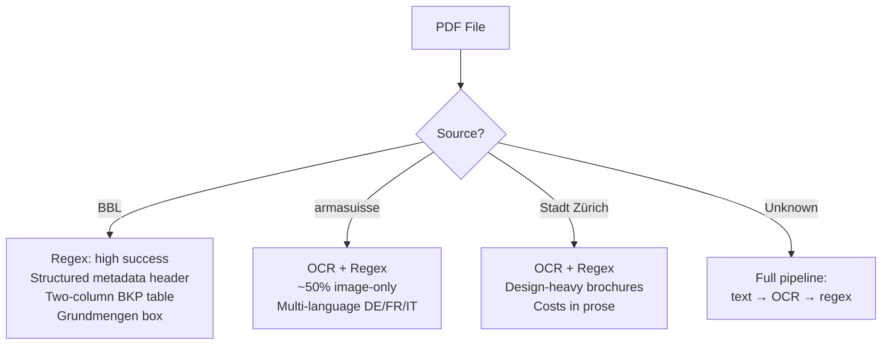

# kennwerte-db — Extraction Pipeline

## Project Context

**kennwerte-db** is an open-source construction cost benchmark database for Swiss public buildings. It collects, structures, and presents cost Kennwerte (CHF/m² GF, CHF/m³ GV, BKP/eBKP-H breakdowns) from realised Bauprojekte to support early-stage cost estimation (Kostenschätzung, Kostenvoranschlag) and portfolio-level cost analysis.

**Related documents**: [SOURCES.md](SOURCES.md) (data source inventory) · [REQUIREMENTS.md](REQUIREMENTS.md) · [DATAMODEL.md](DATAMODEL.md) · [WIREFRAMES.md](WIREFRAMES.md)

---

## Purpose of This Document

Documents the extraction pipeline architecture: how PDFs are downloaded, text extracted (PyMuPDF + Tesseract OCR), images recovered, structured data parsed (regex), quality tracked, and loaded into the SQLite database. This is the operational guide for running and extending the pipeline.

---

## Architecture Overview



---

## File Layout

```
data/
├── pdfs/                       ← downloaded PDFs (flat, gitignored)
│   ├── bbl_verwaltung_2023_Zollikofen.pdf
│   ├── armasuisse_militaer_WaffenplatzThun.pdf
│   ├── stadt-zuerich_hochbau_schulanlage-allmend.pdf
│   ├── download.sh             ← BBL download script
│   ├── download_armasuisse.sh
│   └── download_stadt_zuerich.sh
├── kennwerte.db                ← SQLite database
└── pdf_texts.json              ← legacy text cache (deprecated)
assets/
├── images/
│   ├── thumbnails/             ← page-1 JPEG per project (400px wide)
│   │   ├── 1.jpg
│   │   └── ...
│   └── projects/               ← all extracted photos
│       ├── 1/
│       │   ├── 001.jpg
│       │   └── ...
│       └── ...
scripts/
├── extract.py                  ← single PDF → DB upsert
└── extract_all.py              ← batch wrapper
```

### File Naming Convention

PDFs stored flat with the pattern: `{source}_{category}_{original-filename}.pdf`

**Sources**: `bbl`, `armasuisse`, `stadt-zuerich`, (future: `stadt-bern`, `kanton-bern`, `stadt-sg`, `kanton-ag`)

**Categories**: `verwaltung`, `bundeshaus`, `ausland`, `bildung`, `sport`, `kultur`, `justiz`, `zoll`, `wohnen`, `parkanlagen`, `produktion`, `technik`, `verschiedenes`, `militaer`, `hochbau`

---

## Running the Pipeline

### Prerequisites

```bash
pip install pymupdf pytesseract pillow
# Windows: install Tesseract from https://github.com/UB-Mannheim/tesseract/wiki
# Linux: apt-get install tesseract-ocr tesseract-ocr-deu
```

### Step 1: Download PDFs

```bash
cd data/pdfs
bash download.sh                  # BBL (~142 PDFs, ~586 MB)
bash download_armasuisse.sh       # armasuisse (~52 PDFs, ~459 MB)
bash download_stadt_zuerich.sh    # Stadt Zürich (~36 PDFs, ~282 MB)
```

### Step 2: Extract (single PDF)

```bash
python scripts/extract.py data/pdfs/bbl_verwaltung_2023_Zollikofen.pdf --verbose
```

### Step 3: Extract (all PDFs)

```bash
python scripts/extract_all.py                    # all PDFs
python scripts/extract_all.py --source bbl        # only BBL
python scripts/extract_all.py --force             # re-extract everything
python scripts/extract_all.py --dry-run           # preview only
```

### Step 4: Serve the App

```bash
python -m http.server 8080
# Open http://localhost:8080
```

---

## extract.py — Processing Flow

For each PDF, the script performs 7 steps:

### 1. Identify

- Parse flat filename → source, category, original name
- Compute SHA-256 hash of PDF file
- Check `extraction_log`: if hash matches and `--force` not set, skip

### 2. Extract Text (all pages)

- Open with PyMuPDF (`fitz.open()`)
- For each page:
  - Try `page.get_text()` — if >50 chars, mark as text page
  - If <50 chars and Tesseract available: render to 300 DPI image, OCR with `deu` language
- Concatenate all page texts
- Record method: `pymupdf`, `ocr`, or `pymupdf+ocr`

### 3. Extract Images

- For each page, extract embedded images via `page.get_images(full=True)`
- Filter: skip images smaller than 80×80px (icons, decorative)
- Save to `assets/images/projects/{id}/` as original format (JPEG/PNG)
- Render page 1 as thumbnail → `assets/images/thumbnails/{id}.jpg` (400px wide, JPEG quality 85)

### 4. Parse Structured Data

Source-specific regex patterns applied to the full extracted text:

| Function | Extracts | Key Patterns |
|---|---|---|
| `extract_metadata()` | Bauherrschaft, Nutzer, Architekt, Generalplaner, Generalunternehmer | Label keywords (DE/FR/IT) followed by text block |
| `extract_quantities()` | GF, GV, NGF, floors, workplaces, energy standard | "Geschossfläche Total 28 810 m²", "Gebäudevolumen 95 220 m³" |
| `extract_costs()` | BKP 1–29 + Anlagekosten | Two patterns: same-line ("2 Gebäude  63 572 000") and two-line (code on N, amount on N+1) |
| `extract_benchmarks()` | CHF/m² GF, CHF/m³ GV | "BKP 2/m² GF  2 210" |
| `extract_index_reference()` | Baukostenindex name, date, value, basis | "Baukostenindex Espace Mittelland, Oktober 2010  125.2" |
| `extract_timeline()` | Planungsbeginn, Baubeginn, Bauende | Keyword + date text |
| `extract_description()` | Project description | First paragraph after "Ausgangslage" / "Projektbeschrieb" |

Swiss number parsing: handles space, thin-space, non-breaking space, and apostrophe as thousands separators.

### 5. Compute Quality Grade

| Grade | Criteria |
|---|---|
| **A** | BKP costs + GF + GV + metadata (architect or client) |
| **B** | Costs OR GF + metadata or description |
| **C** | Metadata or description only |
| **D** | Filename-only (no extractable text, OCR failed) |
| **E** | Extraction error (corrupt PDF, crash) |

### 6. Upsert DB

- Match by `pdf_filename` (unique per project)
- If exists: UPDATE all fields, DELETE + re-INSERT related records (costs, benchmarks, timeline)
- If new: INSERT
- Update `extraction_log` with hash, method, pages, chars, images, grade

### 7. Print Summary

```
[A] Eichenweg 1, Neubau Verwaltungsgebäude  (pymupdf, 4409 chars, 12 images)
```

---

## Per-Source Extraction Strategy



---

## Extraction Quality Tracking

### Document Level (`extraction_log` table)

| Field | Description |
|---|---|
| `pdf_hash` | SHA-256 of PDF file (skip re-extraction if unchanged) |
| `method` | `pymupdf`, `ocr`, or `pymupdf+ocr` |
| `pages_total` | Total pages in PDF |
| `pages_with_text` | Pages with >50 chars PyMuPDF text |
| `pages_ocr` | Pages where Tesseract was used |
| `text_chars` | Total extracted characters |
| `images_found` | Embedded images extracted |
| `quality_grade` | A/B/C/D/E |
| `fields_extracted` | JSON: which fields were found and confidence |

### Field Level (`fields_extracted` JSON)

```json
{"gf_m2": "high", "gv_m3": "high", "cost": "high", "architect": "high", "description": "high"}
```

Confidence levels: `high` (regex match on structured text), `medium` (OCR text), `low` (inferred)

---

## Adding a New Source

1. **Research the source** — verify PDFs contain realised costs (see [SOURCES.md](SOURCES.md))
2. **Create download script** — `data/pdfs/download_{source}.sh`
3. **Use flat naming** — `{source}_{category}_{original}.pdf`
4. **Register source** in `scripts/extract.py`:
   - Add to `SOURCES` dict
   - Add category to `CATEGORY_MAP` if new
5. **Test on 3–5 sample PDFs**:
   ```bash
   python scripts/extract.py data/pdfs/new-source_cat_sample.pdf --verbose --dry-run
   ```
6. **Add source-specific patterns** if needed (different labels, cost table format)
7. **Run batch**: `python scripts/extract_all.py --source new-source`
8. **Update [SOURCES.md](SOURCES.md)** with the new source details

---

## Known Limitations

### Extraction
- **OCR quality varies** — Tesseract works well for clean German prints, poorly for design-heavy brochures with overlapping text/images
- **Two-column BKP layout** — interleaved lines are handled (code on line N, amount on N+1) but irregular spacing occasionally causes misses
- **French/Italian PDFs** (~5) — partially handled (alternate label keywords) but coverage incomplete
- **armasuisse filenames** are often UUIDs — project info comes entirely from PDF text

### Data Quality
- **No BPI index adjustment** — costs stored as-recorded at different price levels
- **No deduplication** across sources
- **Municipality-to-canton mapping** hardcoded for ~60 known municipalities

### Pipeline
- **No incremental hash check** yet — `--force` re-extracts everything; hash-based skip is in extraction_log but not yet enforced
- **PyMuPDF memory** — extract_all.py runs each PDF as a separate subprocess, avoiding the segfault issue naturally
