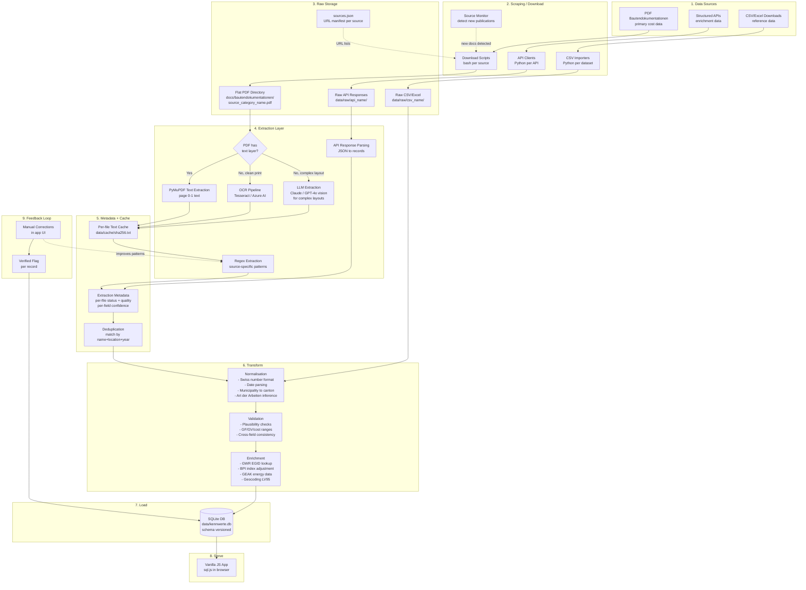
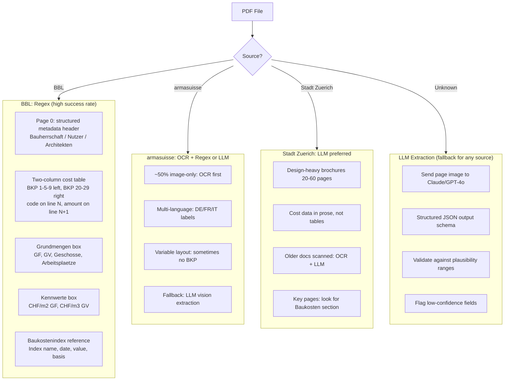
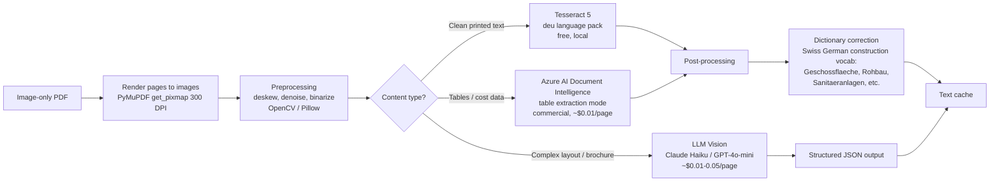
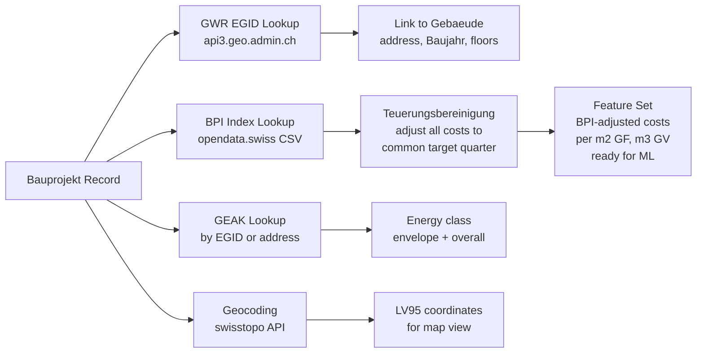

# kennwerte-db --- Data Sources and Scraping Pipeline

## Project Context

**kennwerte-db** is an open-source construction cost benchmark database for Swiss public buildings. It collects, structures, and presents cost Kennwerte (CHF/m2 GF, CHF/m3 GV, BKP/eBKP-H breakdowns) from realised Bauprojekte to support early-stage cost estimation (Kostenschaetzung, Kostenvoranschlag) and portfolio-level cost analysis.

Data is sourced from publicly available Bautendokumentationen published by Swiss federal, cantonal, and municipal building authorities (BBL, armasuisse, Stadt Zuerich, and others). The application is designed as a no-build, static-hosted prototype (GitHub Pages + sql.js) with a path toward a production system.

**Related documents**: [REQUIREMENTS.md](REQUIREMENTS.md) (functional and non-functional requirements) · [DATAMODEL.md](DATAMODEL.md) (entity model and schema)

---

## Purpose of This Document

Documents all data sources (current and potential), the scraping and extraction pipeline architecture, PDF parsing strategies (regex, OCR, LLM), data quality tracking, and instructions for running and extending the pipeline. This is the operational guide for acquiring and processing data into kennwerte-db.

---

## Current Sources

### 1. BBL Bautendokumentationen (Federal Civil Buildings)

| | |
|---|---|
| **Bauherr** | Bundesamt fuer Bauten und Logistik (BBL) |
| **URL** | https://www.bbl.admin.ch/de/bautendokumentationen |
| **Format** | PDF (2--30 MB each) |
| **Count** | 144 documents |
| **Coverage** | 1999--2023 |
| **Categories** | Bundeshaus, Verwaltung, Kultur, Sport, Bildung, Justiz, Zoll, Ausland, Wohnen, Parkanlagen, Produktion, Technik |
| **Content** | Project description, Bauherrschaft, Architekten, Fachplaner, BKP cost breakdown, SIA 416 quantities (GF, GV), Kennwerte (CHF/m2, CHF/m3), Baukostenindex reference, photos, plans |
| **Download** | `bash docs/bautendokumentationen/download.sh` |
| **Extraction quality** | Good --- ~80% have extractable text with BKP costs and GF |

### 2. armasuisse Bautendokumentationen (Military Buildings)

| | |
|---|---|
| **Bauherr** | armasuisse Immobilien (VBS) |
| **URL** | https://www.ar.admin.ch/de/bautendokumentationen |
| **Format** | PDF (2--16 MB each) |
| **Count** | 53 documents |
| **Coverage** | ~2005--2025 |
| **Categories** | Industrie/Gewerbe, Handel/Verwaltung, Unterkunft/Verpflegung, Sport, Militaerobjekte, Verkehr |
| **Content** | Similar to BBL but for military buildings --- Kasernen, Waffenplaetze, Flugplaetze, Logistikzentren |
| **Download** | `bash docs/bautendokumentationen/download_armasuisse.sh` |
| **Extraction quality** | Mixed --- many image-only PDFs (scanned), different layout from BBL |

### 3. Stadt Zuerich Baudokumentation (Municipal Buildings)

| | |
|---|---|
| **Bauherr** | Stadt Zuerich, Hochbaudepartement (HBD) |
| **URL** | https://www.stadt-zuerich.ch/de/aktuell/publikationen.html (search: Baudokumentation) |
| **Format** | PDF (1--28 MB each) |
| **Count** | 36 documents |
| **Coverage** | ~2008--2026 |
| **Categories** | Schulanlagen, Wohnsiedlungen, Sportanlagen, Kulturbauten, Gesundheitszentren, Infrastruktur |
| **Content** | Detailed project docs --- often 20--60 pages, high quality photography, less structured cost data |
| **Download** | `bash docs/bautendokumentationen/download_stadt_zuerich.sh` |
| **Extraction quality** | Low --- many older PDFs are image-only (scanned brochures), cost data rarely in structured format |

---

## File Naming Convention

All PDFs are stored flat in `docs/bautendokumentationen/` with the naming pattern:

```
{source}_{category}_{original-filename}.pdf
```

Examples:
- `bbl_verwaltung_20230101_Zollikofen_Eichenweg 5_Neubau Verwaltungsgebaeude.pdf`
- `armasuisse_militaer_WaffenplatzThunBENeubauSporthalle_DE.pdf`
- `stadt-zuerich_hochbau_schulanlage-allmend-baudokumentation.pdf`

**Sources**: `bbl`, `armasuisse`, `stadt-zuerich`
**Categories**: `verwaltung`, `bundeshaus`, `ausland`, `bildung`, `sport`, `kultur`, `justiz`, `zoll`, `wohnen`, `parkanlagen`, `produktion`, `technik`, `verschiedenes`, `militaer`, `hochbau`

---

## Potential Future Sources

**Scope**: We focus exclusively on **publicly available data** with **realised construction costs** (Schlussabrechnungen, not estimates or contract awards). Sources must be legally usable without commercial licence restrictions.

### Structured APIs (for enrichment, not primary cost data)

| Source | Data | Format | URL | Notes |
|---|---|---|---|---|
| **BFS Baupreisindex (BPI)** | Semiannual construction price indices by Grossregion, Neubau/Umbau, Hochbau/Tiefbau | CSV/XLS | https://opendata.swiss/de/dataset/schweizerischer-baupreisindex-entwicklung-der-baupreise-multibasen-indexwerte-pro-grossregion-u3-1 | Free. Essential for Teuerungsbereinigung. Note: BPI (Baupreisindex, measures price changes) differs from BKI (Baukostenindex, input-cost based) --- BPI is the standard for project cost adjustment |
| **GWR / GeoAdmin API** | Building register (EGID, address, Baujahr, floors, heating) | REST/WFS | https://api3.geo.admin.ch / https://github.com/liip/open-swiss-buildings-api | Free. For EGID lookup and linking Bauprojekte to Gebaeude records |
| **Stadt Zuerich GWZ** | Zurich building register (daily updates) | GeoJSON/WFS | https://data.stadt-zuerich.ch/dataset/geo_gebaeude__und_wohnungsregister_der_stadt_zuerich__gwz__gemaess_gwr_datenmodell | Free, very current |
| **Basel-Stadt GWR** | Basel building register with API console | REST | https://data.bs.ch/explore/dataset/100230/api/ | Free |
| **GEAK** | Building energy certificates (envelope + consumption class) | Portal/Geo | https://opendata.swiss/de/dataset/gebaudeenergieausweis-der-kantone-geak-offentlich | Free, certificates post-2019 only |
| **BFE Gebaeudeprogramm** | Subsidised energy renovation data | Portal | https://www.dasgebaeudeprogramm.ch/ | Free. Useful for Sanierung cost benchmarks |

### More PDF Sources (Bautendokumentationen with realised costs)

These are the highest-value targets --- public Bautendokumentationen from other Swiss building owners that typically contain BKP cost breakdowns and SIA 416 quantities from completed projects.

| Source | Bauherr | Est. Count | URL | Priority | Notes |
|---|---|---|---|---|---|
| **Kanton Zuerich Hochbauamt** | Kanton Zuerich | unknown | https://www.zh.ch/de/planen-bauen/hochbau.html | High | Cantonal buildings: schools, hospitals, police, courts. Separate portfolio from Stadt Zuerich |
| **ETH Zurich** | ETH-Bereich | ~20 | https://ethz.ch/en/campus/development/construction-projects.html | High | Public docs for projects > CHF 10M. Labs, lecture halls, research buildings |
| **Other large cities** | various municipal | unknown | Individual city websites | Medium | Basel, Bern, Lausanne, Genf, St. Gallen, Luzern --- many publish Baudokumentationen for public buildings |
| **Other cantons** | various cantonal | unknown | Individual canton Hochbauamt websites | Medium | Bern, Aargau, Basel-Land, Waadt, etc. |
| **SBB** | SBB Infrastruktur | unknown | https://data.sbb.ch/ | Low | 89 datasets, but mostly operational data; construction docs unclear |

### Bulk Data Downloads (for enrichment, not primary costs)

| Source | Content | Format | URL | Use case |
|---|---|---|---|---|
| **BFS Building Statistics** | Annual building/dwelling stats nationwide | CSV | https://opendata.swiss/en/dataset/gebaude-und-wohnungsstatistik-wohnungen | Context: building stock composition, construction activity trends |
| **swissBUILDINGS3D** | 3D building models (17 cantons) | CityGML/GeoTIFF | https://opendata.swiss/en/dataset/swissbuildings3d-3-0-beta | Context: building geometry, volumes |
| **Canton OGD portals** | Building registers, GWR extracts | Various | https://github.com/rnckp/awesome-ogd-switzerland | Enrichment: building metadata per EGID |

### Commercial Sources (noted for reference, not usable without licence)

| Source | Notes |
|---|---|
| **werk-material.online** | ~2000+ projects, full BKP/eBKP-H, SIA 416. Gold standard for Swiss Kennwerte. Commercial licence required (CRB/wbw partnership). Not usable for this project |
| **FPRE/PBK API** | REST API with eBKP-H structured cost data. Commercial. Most comprehensive programmatic cost data |

---

## Scraping and Extraction Pipeline

### Architecture Overview



### Design Principles

1. **Incremental processing**: Only extract new/changed PDFs. The cache is keyed by file hash (SHA-256), so re-running the pipeline skips already-extracted files.
2. **Field-level confidence**: Each extracted value carries a confidence indicator (regex match quality, OCR confidence score, LLM extraction certainty) stored in the metadata layer.
3. **Deduplication**: Projects appearing in multiple sources (e.g. a BBL-funded building in Zuerich) are matched by project name + municipality + completion year, with source priority rules (Schlussabrechnung > Kostenvoranschlag, BBL > municipal).
4. **Schema versioning**: The DB embeds a `schema_version` in a `meta` table. When the schema changes, the build script applies migrations or rebuilds from cache.
5. **Source manifests**: Download URLs are stored in `sources.json` (not hardcoded in bash scripts), making it easy to add URLs without editing download logic.
6. **Feedback loop**: Manual corrections in the app are persisted and fed back into extraction quality assessment. A `manually_verified` flag marks human-validated records.

### Per-Source Extraction Strategy

Each PDF source has a different layout. The extraction layer selects the best strategy per source:



**LLM extraction** is the recommended approach for sources with inconsistent layouts. The cost per PDF page is low (~$0.01--0.05 with Claude Haiku or GPT-4o-mini vision), and it handles table layouts, multi-column text, and mixed languages far better than regex. For the ~70 image-only PDFs in the current collection, LLM vision extraction would likely recover structured data from 50--60 of them.

**Recommended extraction order**:
1. Try PyMuPDF text extraction (free, fast)
2. If text quality is good: apply source-specific regex patterns
3. If text is empty or regex yields < 3 fields: try OCR (Tesseract)
4. If OCR text is poor or layout is complex: use LLM vision extraction
5. Store the method used in extraction metadata

### Extraction Quality Tracking

Quality is tracked at two levels: per-document and per-field.

**Document-level quality** (stored in `extraction_metadata`):

| Level | Description | Criteria |
|---|---|---|
| **A - Complete** | All key fields extracted | BKP costs + GF + GV + metadata + description |
| **B - Partial** | Some structured data | Either costs OR quantities + metadata |
| **C - Metadata only** | Only project identification | Name, location, date from filename + basic text |
| **D - Filename only** | No extractable text | Image-only PDF, all data from filename |
| **E - Failed** | Extraction error | PDF corrupt or crashes parser |
| **V - Verified** | Human-reviewed and corrected | Manual verification flag set |

**Field-level confidence** (stored per extracted value):

| Confidence | Source | Example |
|---|---|---|
| **high** | Regex match on structured table cell | GF from "Geschossflaeche Total 28 810 m2" |
| **medium** | Regex match on running text, or OCR output | GF mentioned in project description |
| **low** | LLM extraction, or ambiguous match | GF inferred from context |
| **manual** | Human-entered or corrected | User corrected via app UI |

**Extraction method** is recorded per document: `pymupdf_regex`, `ocr_regex`, `llm_vision`, `manual`.

### OCR Pipeline

For image-only PDFs (~30% of collection, ~70 files), an OCR pipeline recovers text:



**Quality measurement**: Run OCR on 10 manually transcribed pages, measure character error rate (CER). Target: < 2% CER for clean prints, < 5% for older scanned brochures.

**Swiss construction vocabulary** for OCR post-correction:
- BKP terms: Vorbereitungsarbeiten, Rohbau, Elektroanlagen, HLKK, Sanitaeranlagen, Ausbau, Honorare
- SIA 416 terms: Geschossflaeche, Nettogeschossflaeche, Hauptnutzflaeche, Gebaeudevolumen
- Measurement units: m2, m3, CHF, CHF/m2, kWh/m2a
- Swiss formatting: space as thousands separator (16 830 000), comma as decimal (3,5)

### Data Enrichment Pipeline (Future)



**BPI adjustment details**: The BFS publishes the Baupreisindex (BPI) semiannually (April and October) by Grossregion. The relevant sub-indices are:
- *Hochbau Neubau* (for Neubau projects)
- *Hochbau Renovation* (for Umbau/Sanierung projects)

Adjustment formula: `cost_adjusted = cost_recorded * (BPI_target / BPI_recorded)`

The BPI CSV from opendata.swiss contains multi-base indices (Oct 1998=100, Oct 2010=100, Oct 2015=100, Oct 2020=100). The pipeline must handle base year conversion.

### Data Versioning

For reproducibility (especially if ML models are trained on this data), the pipeline tracks versions:

| What | How | Why |
|---|---|---|
| **DB schema** | `meta` table with `schema_version` integer | Detect when migrations are needed |
| **Input inventory** | SHA-256 hash of each PDF stored in extraction metadata | Know exactly which files produced which DB |
| **Extraction script** | Git commit hash embedded in DB `meta` table at build time | Reproduce any historical DB state |
| **DB snapshot** | `data/kennwerte.db` committed to repo (536 KB) | Every git commit is a reproducible snapshot |

For larger-scale ML work, consider DVC (Data Version Control) to track the relationship between input PDFs, extraction parameters, and output datasets.

---

## Running the Pipeline

### Prerequisites

```bash
pip install pymupdf   # PDF text extraction (PyMuPDF / fitz)
# Optional for OCR:
# pip install pytesseract pillow
# apt-get install tesseract-ocr tesseract-ocr-deu
```

### Step 1: Download PDFs

```bash
cd docs/bautendokumentationen
bash download.sh                  # BBL (144 PDFs, ~586 MB)
bash download_armasuisse.sh       # armasuisse (53 PDFs, ~459 MB)
bash download_stadt_zuerich.sh    # Stadt Zuerich (36 PDFs, ~282 MB)
```

### Step 2: Extract and Build Database

```bash
python scripts/build_db.py
# Pass 1: Extracts text from all PDFs (cached in data/pdf_texts.json)
#          Only processes new/changed files (incremental)
# Pass 2: Parses extracted text and builds data/kennwerte.db
```

### Step 3: Fix Failed Extractions (optional)

```bash
python scripts/fix_cache.py   # Re-extracts PDFs that failed in batch processing
python scripts/build_db.py    # Rebuild DB from updated cache
```

### Step 4: Verify Downloaded PDFs (optional)

```bash
# Check that all downloaded files are valid PDFs (not HTML error pages or truncated)
python scripts/verify_downloads.py   # future: checks %PDF header, min file size
```

### Step 5: Serve the App

```bash
python -m http.server 8080
# Open http://localhost:8080
```

---

## Adding a New Source

1. **Research the source**: Verify that the data is publicly available and legally usable. Focus on sources with realised construction costs (Schlussabrechnungen), not just estimates or contract values.

2. **Collect PDF URLs**: Create `docs/bautendokumentationen/download_{source}.sh` with curl commands. Consider storing URLs separately in a `sources.json` manifest for easier maintenance.

3. **Use flat naming**: `{source}_{category}_{original-filename}.pdf`
   - Source codes should be short, lowercase, hyphenated: `bbl`, `armasuisse`, `stadt-zuerich`, `kanton-zh`, `eth`
   - Category should match an existing `CATEGORY_MAP` entry or define a new one

4. **Register the source** in `scripts/build_db.py`:
   - Add to `SOURCES` dict (code -> client org name)
   - Add category to `CATEGORY_MAP` if new
   - Add to `ref_data_source` INSERT in the schema

5. **Test extraction on 3--5 sample PDFs**: Check what text PyMuPDF extracts, whether the existing regex patterns match, and whether source-specific patterns are needed.

6. **Add source-specific extraction logic** if the PDF layout differs significantly from BBL. Consider LLM extraction for sources with inconsistent or design-heavy layouts.

7. **Rebuild**: `rm data/pdf_texts.json && python scripts/build_db.py`

8. **Check for duplicates**: If the new source overlaps with existing sources (same buildings), add dedup rules.

9. **Update this document** with the new source details in the "Current Sources" section.

---

## Known Limitations

### Extraction

- **~30% of PDFs are image-only** (scanned brochures) and yield no text without OCR or LLM vision
- **Two-column cost layouts** in BBL PDFs cause line interleaving --- the parser handles code-on-one-line + amount-on-next-line, but occasionally misses BKP sub-positions (21--28) when the layout is irregular
- **armasuisse filenames** are often UUIDs with no metadata --- project info comes entirely from PDF text
- **Stadt Zuerich PDFs** are design-heavy brochures with costs rarely in tabular format --- LLM extraction recommended
- **French/Italian PDFs** (~5) use different label keywords --- partially handled (Bauherrschaft/Maitre de l'ouvrage) but coverage is incomplete

### Data Quality

- **No BPI index adjustment** --- costs are stored as-recorded at different price levels (1998--2025). Cross-project comparison requires manual awareness of the price level year
- **No deduplication** across sources --- the same project could appear twice if covered by multiple Bautendokumentationen
- **No field-level confidence** yet --- all extracted values are treated equally regardless of extraction method
- **Municipality-to-canton mapping** is hardcoded for ~50 known municipalities. Projects in unmapped locations get `canton = NULL`

### Pipeline

- **Not incremental** --- the current implementation re-extracts all PDFs when the cache is deleted. Incremental processing (hash-based cache keying) is designed but not yet implemented
- **No CI/CD** --- the pipeline runs manually. A Makefile or GitHub Action to automate download-extract-build-deploy is a logical next step
- **Download URLs are hardcoded** in bash scripts --- when source websites reorganise (common for Swiss government), all URLs break. Migration to a `sources.json` manifest would improve maintainability
- **PyMuPDF memory issues** --- the PDF library crashes (segfault) when processing 30+ large PDFs in a single process. The pipeline works around this by processing in batches of 15 via subprocesses
