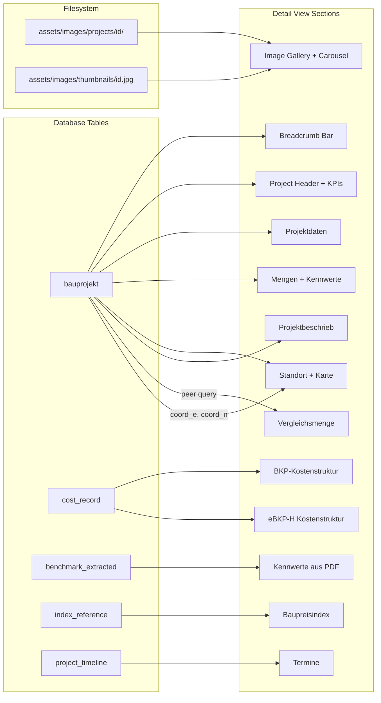
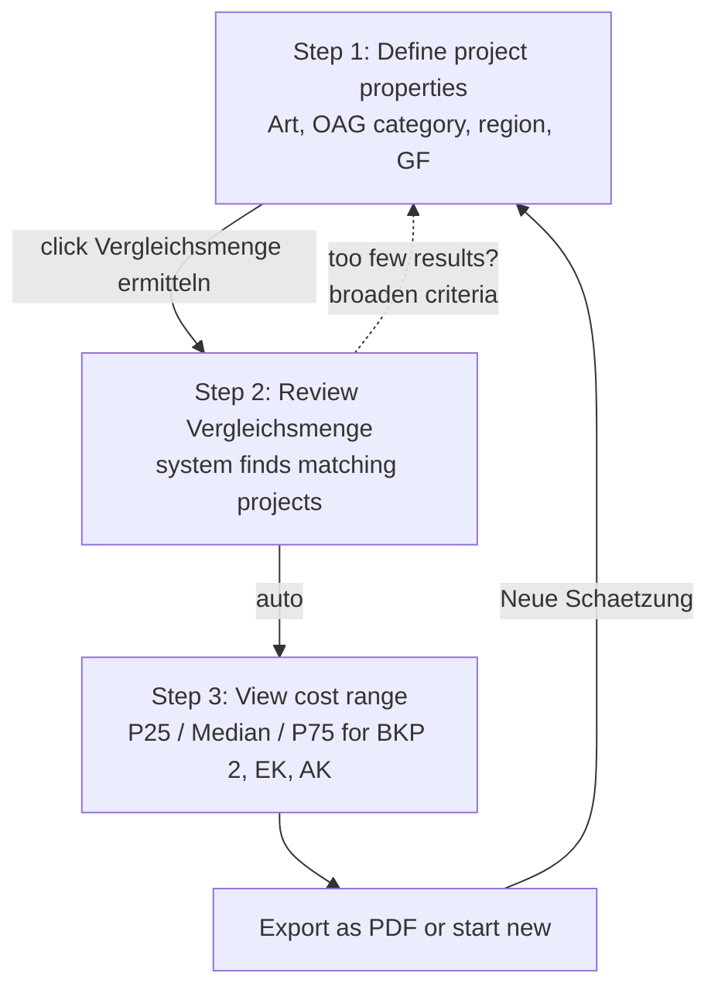
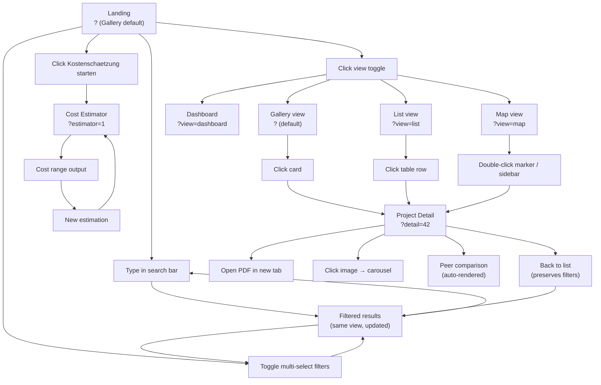
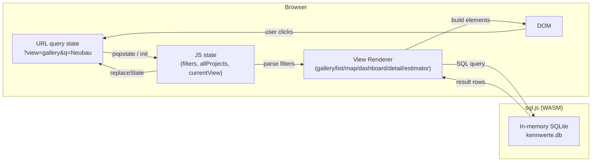

# kennwerte-db --- UI Wireframes

## Project Context

**kennwerte-db** is an open-source construction cost benchmark database for Swiss public buildings. It collects, structures, and presents cost Kennwerte (CHF/m2 GF, CHF/m3 GV, BKP/eBKP-H breakdowns) from realised Bauprojekte to support early-stage cost estimation (Kostenschaetzung, Kostenvoranschlag) and portfolio-level cost analysis.

Data is sourced from publicly available Bautendokumentationen published by Swiss federal, cantonal, and municipal building authorities (BBL, armasuisse, Stadt Zuerich, and others). The application is designed as a no-build, static-hosted prototype (GitHub Pages + sql.js) with a path toward a production system.

**Related documents**: [REQUIREMENTS.md](REQUIREMENTS.md) (functional and non-functional requirements) · [DATAMODEL.md](DATAMODEL.md) (entity model and schema) · [SOURCES.md](SOURCES.md) (data source inventory) · [PIPELINE.md](PIPELINE.md) (extraction pipeline)

---

## Purpose of This Document

ASCII wireframes for the single-page vanilla JS prototype. Defines the layout, navigation, view modes, and interaction patterns before implementation. Inspired by the transaction-immo frontend patterns (design tokens, view toggles, URL state, card grid).

---

## Navigation Model

URL state uses query parameters (not hash fragments) for full shareability and browser back/forward support:

```
?                           --> Gallery view (default)
?view=gallery               --> Gallery view
?view=list                  --> List view
?view=map                   --> Map view
?view=dashboard             --> Dashboard view
?q=Neubau&cat=verwaltung    --> Filtered gallery
?detail=42                  --> Project detail
?estimator=1                --> Cost estimator
```

Multi-select filters are serialized as comma-separated values: `?src=bbl,armasuisse&art=NEUBAU,UMBAU`. All filter state is encoded in URL query parameters for shareability.

---

## 1. Main View --- Gallery (Default)

The gallery is the primary entry point. It presents projects as visual cards in a responsive grid, optimised for scanning and visual comparison. Users land here and progressively narrow their selection through search and filters.

**Header**: Fixed top bar with logo left, "Kostenschaetzung starten" CTA button right (always visible, Swiss red accent). The header stays minimal --- no hamburger menus or secondary nav.

**Search bar**: Full-width, prominent, immediately below header. Searches across project name, municipality, architect, and description. 300ms debounce. Clear button appears when text is entered. This is the primary discovery mechanism.

**Filter bar**: Horizontal row of **multi-select dropdown** filters below search. Each dropdown shows checkboxes for all distinct values from the DB; multiple selections per filter are supported (e.g. selecting both BBL and armasuisse as sources). When filters are active, a count badge appears on the dropdown button (e.g. "Quelle (2)") and removable pills appear below the dropdowns. All filters combine with AND logic. An "Erweiterte Filter" button opens a modal for additional filters (year range). A "Alle zuruecksetzen" pill clears all active filters.

**Results count + Sort + View toggle**: Left-aligned results count ("233 Projekte") updates live as filters change. A sort dropdown allows sorting by year, CHF/m2, GF, or cost. Right-aligned toggle with four icon buttons in this order: **Karte, Galerie (default/active), Liste, Dashboard**. The active view is highlighted with its label visible. Switching views preserves all filter state.

**Card grid**: 3 columns on desktop, 2 on tablet, 1 on mobile. Cards are the core UI element --- each represents one Bauprojekt. Cards are clickable (entire card is a link to the detail view). Hover effect: subtle lift (translateY -2px) and shadow increase.

**Sort**: Default sort is by completion year descending (newest first). The sort dropdown in the filter bar controls sorting across all views. Options: Jahr (neueste/aelteste), CHF/m2 (niedrigste/hoechste), GF (groesste/kleinste), Kosten (hoechste). In list view, column headers are additionally sortable by click.

**Empty state**: If no projects match the current filters, show a friendly message with suggestions ("Versuchen Sie einen breiteren Suchbegriff oder setzen Sie Filter zurueck").

```
+============================================================================+
|  kennwerte-db                                    [Kostenschaetzung starten] |
+============================================================================+
|                                                                            |
|  +----------------------------------------------------------------------+  |
|  | Q  Suche: Projekt, Ort, Architekt...                            [X]  |  |
|  +----------------------------------------------------------------------+  |
|                                                                            |
|  [Quelle v] [Kategorie v] [Kanton v] [Art v] [Filter]                      |
|                                                                            |
|  233 Projekte     [Sort v]      [o Karte] [||| Galerie] [= Liste] [# Dash]|
|                                                                            |
|  +---------------------+  +---------------------+  +---------------------+ |
|  | +---[PDF]----------+|  | +------------------+|  | +------------------+| |
|  | |                   ||  | |                  ||  | |                  || |
|  | |   (placeholder    ||  | |   (placeholder   ||  | |   (placeholder   || |
|  | |    or first page  ||  | |    thumbnail)    ||  | |    thumbnail)    || |
|  | |    thumbnail)     ||  | |                  ||  | |                  || |
|  | +-------------------+|  | +------------------+|  | +------------------+| |
|  |                      |  |                     |  |                     | |
|  | Eichenweg 5, Neubau  |  | Bundeshaus Ost,    |  | Schulanlage        | |
|  | Verwaltungsgebaeude   |  | Umbau + Sanierung  |  | Allmend             | |
|  | Zollikofen BE · 2023  |  | Bern BE · 2016     |  | Zuerich ZH · 2024  | |
|  |                      |  |                     |  |                     | |
|  | GF 33'600 m2         |  | GF 16'610 m2       |  |  ---                | |
|  | CHF 90.2 Mio.        |  | CHF 61.9 Mio.      |  |  ---                | |
|  | CHF/m2 GF   2'685    |  | CHF/m2 GF   3'727  |  |                     | |
|  |                      |  |                     |  |                     | |
|  | [Neubau]  [BBL]      |  | [Sanierung] [BBL]  |  | [---] [StadtZH]    | |
|  +----------------------+  +---------------------+  +---------------------+ |
|                                                                            |
|  +---------------------+  +---------------------+  +---------------------+ |
|  | ...                  |  | ...                 |  | ...                 | |
|  +---------------------+  +---------------------+  +---------------------+ |
|                                                                            |
+============================================================================+
```

### Card Anatomy

Each card shows the minimum information needed to decide whether a project is relevant for comparison. The layout prioritises the benchmark KPI (CHF/m2 GF) --- this is the number a Bauoekonom scans for.

**Image area** (180px height): Shows the PDF first-page thumbnail extracted by the pipeline (stored in `assets/images/thumbnails/{id}.jpg`). Falls back to a coloured placeholder with a category icon and source label when no thumbnail is available. Source-specific gradient backgrounds (BBL grey, armasuisse green, Stadt Zuerich blue). Overlay tags in the top-left corner show source and Art der Arbeiten as coloured pills.

**Text block**: Project name (bold, max 2 lines with ellipsis), then location line (Municipality, Canton abbreviation, dot separator, year). These three data points --- what, where, when --- let users identify a project at a glance.

**KPI block** (2x2 grid): GF and GV on the first row (the physical size), total cost and CHF/m2 GF on the second row (the benchmark value). Missing values show a dash. CHF/m2 GF is the most important number and gets bold/accent treatment. Costs are shown in millions with 1 decimal ("CHF 90.2 Mio.") for readability.

```
+--------------------------------------+
| +----------------------------------+ |     Image area: PDF first-page thumbnail
| |           180px                  | |     or placeholder with source logo.
| |     PDF thumbnail / placeholder  | |     Tags overlay: [Art] [Quelle]
| |                                  | |
| |                    [Neubau][BBL] | |
| +----------------------------------+ |
|                                      |
| Project Name (bold, max 2 lines)     |     Primary identifier
| Municipality Canton · Year           |     Location + date line
|                                      |
| GF  33'600 m2    GV  95'220 m3      |     Key quantities (2-col grid)
| CHF 90.2 Mio.    CHF/m2 GF  2'685   |     Cost + benchmark KPI
|                                      |
+--------------------------------------+
```

### Filter Bar Detail

Each dropdown is a multi-select with checkboxes. Clicking the button toggles the dropdown open/closed. Clicking outside closes it. The button shows a count badge when filters are active (e.g. "Quelle (2)"). An additional "Filter" icon button opens a modal with year range inputs and all filter options for mobile use.

```
+------------------------------------------------------------------------+
| [Quelle v] [Kategorie v] [Kanton v] [Art v]  [tune]                   |
|  +---------------------------+                                          |
|  | [x] BBL                   |                                          |
|  | [x] armasuisse            |      Dropdown: multi-select with         |
|  | [ ] Stadt Zuerich         |      checkboxes. Multiple values can     |
|  +---------------------------+      be selected simultaneously.          |
|                                                                         |
| Aktive Filter: [Quelle: BBL, armasuisse x] [Art: Neubau x] [Reset all]|
+------------------------------------------------------------------------+
```

---

## 2. Main View --- List

The list view is the analytical counterpart to the gallery. It shows more data per project in less space, supports column sorting, and includes an aggregate statistics row. This is the view a Bauoekonom uses when they already know what they're looking for and want to compare numbers quickly.

**Stats row**: Five summary boxes above the table showing aggregate KPIs for the current filter selection. These update live as filters change:
- Total project count
- Count with GF data
- Count with cost data
- Median CHF/m2 GF (the key aggregate benchmark)
- Number of distinct sources

The stats row gives immediate context: "Am I looking at a meaningful sample?"

**Table**: Sortable by clicking column headers (toggle asc/desc). Columns are chosen for maximum density: Year, Location (municipality + canton), Project name, Category + Source, Art der Arbeiten (as coloured pill), GF + CHF/m2 GF (stacked in one column to save space). Rows are clickable --- full row is a link to the detail view.

**Sticky header**: The table header stays visible while scrolling, following the transaction-immo pattern. The sort indicator (arrow) shows in the active column.

```
+============================================================================+
|  kennwerte-db                                    [Kostenschaetzung starten] |
+============================================================================+
|                                                                            |
|  +----------------------------------------------------------------------+  |
|  | Q  Suche: Projekt, Ort, Architekt...                            [X]  |  |
|  +----------------------------------------------------------------------+  |
|                                                                            |
|  [Quelle v] [Kategorie v] [Kanton v] [Art v] [Filter]                      |
|                                                                            |
|  233 Projekte     [Sort v]      [o Karte] [||| Galerie] [= Liste] [# Dash]|
|                                                                            |
|  +----------------------------------------------------------------------+  |
|  | +----------+ +----------+ +----------+ +----------+ +----------+     |  |
|  | | 233      | | 60       | | 106      | | 2'685    | | 3 Quellen|     |  |
|  | | Projekte | | mit GF   | | m. Kosten| | Med.CHF/ | |          |     |  |
|  | |          | |          | |          | | m2 GF    | |          |     |  |
|  | +----------+ +----------+ +----------+ +----------+ +----------+     |  |
|  +----------------------------------------------------------------------+  |
|                                                                            |
|  +----------------------------------------------------------------------+  |
|  | Jahr v | Ort       | Projekt              | Kat.  | Art    | GF m2  |  |
|  |        |           |                      |       |        | CHF/m2 |  |
|  +--------+-----------+----------------------+-------+--------+--------+  |
|  | 2023   | Zollikofen| Eichenweg 5, Neubau  | Verw. |[Neubau]| 33'600 |  |
|  |        | BE        | Verwaltungsgebaeude   | BBL   |        |  2'685 |  |
|  +--------+-----------+----------------------+-------+--------+--------+  |
|  | 2023   | Magglingen| Alpenstrasse 18,     | Sport |[Neubau]|   ---  |  |
|  |        | BE        | Neubau Laerchenplatz  | BBL   |        |   ---  |  |
|  +--------+-----------+----------------------+-------+--------+--------+  |
|  | 2022   | Magglingen| Ausbildungshalle     | Sport |[San.]  |  9'993 |  |
|  |        | BE        |                      | BBL   |        |  2'963 |  |
|  +--------+-----------+----------------------+-------+--------+--------+  |
|  | ...    | ...       | ...                  | ...   | ...    |  ...   |  |
|  +----------------------------------------------------------------------+  |
|                                                                            |
+============================================================================+
```

---

## 3. Main View --- Map

The map view provides geographic context. Swiss public construction is heavily concentrated in Bern (federal), Zuerich (cantonal/municipal), and a few military locations. The map makes regional distribution visible and helps identify comparable projects by proximity.

**Layout**: Sidebar (320px) + map (remaining width), following the transaction-immo pattern. The sidebar contains compact project cards (name, location, year, CHF/m2 GF). The map fills the rest.

**Map technology**: MapLibreGL with CartoDB Positron vector basemap (free, no API key required). A future version could switch to swisstopo for Swiss-specific cartographic detail. Markers are coloured by Art der Arbeiten (green = Neubau, blue = Sanierung, amber = Umbau). Marker size can optionally scale with GF to show project magnitude (v2).

**Interaction**: Clicking a sidebar item flies the map to that location and highlights the marker. Clicking a marker highlights the corresponding sidebar item and scrolls it into view. A "Details anzeigen" button appears on the active sidebar item. Double-clicking either the marker or the sidebar item navigates to the detail view.

**Coordinate coverage**: Projects with geocoded coordinates (`coord_lat`, `coord_lng` on `bauprojekt`) are placed precisely. Projects without coordinates fall back to canton centroid with random jitter to avoid overlapping. Projects without any location data are shown in the sidebar but not on the map.

**Responsive**: On screens < 900px, the sidebar stacks above the map (sidebar becomes a horizontal scroll strip, map fills the width below).

```
+============================================================================+
|  kennwerte-db                                    [Kostenschaetzung starten] |
+============================================================================+
|                                                                            |
|  +----------------------------------------------------------------------+  |
|  | Q  Suche: Projekt, Ort, Architekt...                            [X]  |  |
|  +----------------------------------------------------------------------+  |
|                                                                            |
|  [Quelle v] [Kategorie v] [Kanton v] [Art v] [Filter]                      |
|                                                                            |
|  233 Projekte     [Sort v]      [o Karte] [||| Galerie] [= Liste] [# Dash]|
|                                                                            |
|  +-------------------+----------------------------------------------------+|
|  | Sidebar (320px)   |                                                    ||
|  |                   |              MAP                                   ||
|  | +---------------+ |                                                    ||
|  | | Eichenweg 5   | |        .---.                                       ||
|  | | Zollikofen BE | |       /  o  \    o = project markers               ||
|  | | 2023 · 2'685  | |      / o   o \   color = Art der Arbeiten          ||
|  | | CHF/m2 GF     | |     |  o  o   |  size = GF (optional)              ||
|  | +---------------+ |     | o    o  |                                    ||
|  |                   |      \  o    /                                     ||
|  | +---------------+ |       \ oo /                                       ||
|  | | Bundeshaus Ost| |        '--'                                        ||
|  | | Bern BE       | |                                                    ||
|  | | 2016 · 3'727  | |   Switzerland (swisstopo basemap)                  ||
|  | | CHF/m2 GF     | |                                                    ||
|  | +---------------+ |   Click marker -> highlight sidebar item            ||
|  |                   |   Click sidebar -> fly to marker                    ||
|  | +---------------+ |                                                    ||
|  | | Schulanlage   | |   [+][-] zoom controls                             ||
|  | | Allmend        | |                                                    ||
|  | | Zuerich ZH    | |   Note: ~50% of projects have no coordinates.      ||
|  | +---------------+ |   They are placed at municipality centroid or       ||
|  |                   |   excluded from map view.                           ||
|  | ...               |                                                    ||
|  +-------------------+----------------------------------------------------+|
|                                                                            |
+============================================================================+
```

---

## 3.5. Main View --- Dashboard

The dashboard provides aggregate analytics across all projects (or the currently filtered set). It is the fourth view toggle option, positioned after Liste and before the detail view. It helps answer portfolio-level questions: "How many projects have cost data?", "What does the CHF/m2 distribution look like?", "Which categories dominate?"

**Stats row**: Same five summary boxes as the list view (total projects, with GF, with cost data, median CHF/m2 GF, source count). These update live as filters change.

**CHF/m2 GF distribution**: Box plot showing the full cost range across the current selection (Min, P25, Median, P75, Max). Provides immediate visual context for the cost benchmark landscape.

**Category breakdown**: Bar chart table showing each Gebaeuedekategorie with project count and average CHF/m2 GF. Bars are proportional to the average cost, enabling quick visual comparison across building types.

**Source breakdown**: Shows each data source (BBL, armasuisse, Stadt Zuerich) with total project count and how many have benchmark values.

**Year distribution**: Horizontal bar chart showing project count per completion year, revealing temporal coverage and any gaps in the data.

```
+============================================================================+
|  233 Projekte  |  60 mit GF  |  106 m. Kosten  |  2'685 Med.  |  3 Quellen|
+============================================================================+
|                                                                            |
|  CHF/m2 GF --- Verteilung                                                 |
|  |----[========|=======X=======|========]----|                             |
|  Min 845   P25 2'100   Med 2'685   P75 3'500   Max 8'200                  |
|                                                                            |
|  +-------------------------------+  +-------------------------------+      |
|  | NACH KATEGORIE                |  | NACH QUELLE                   |      |
|  | Verwaltung   85  Ø 2'950  === |  | BBL          156 (89 m. KW)  |      |
|  | Sport        42  Ø 3'200  ==  |  | armasuisse    52 (12 m. KW)  |      |
|  | Bildung      31  Ø 2'100  ==  |  | Stadt ZH      25 ( 5 m. KW)  |      |
|  | ...                           |  |                               |      |
|  +-------------------------------+  +-------------------------------+      |
|                                                                            |
|  PROJEKTE NACH FERTIGSTELLUNGSJAHR                                         |
|  ||  || ||| |||||||| |||||||||||||||||||||||                                |
|  99 01 03 05  07  09  11  13  15  17  19  21 23                            |
+============================================================================+
```

---

## 4. Project Detail View

Triggered by clicking a card, table row, or map marker. Replaces the main view (full-page, not a modal). A breadcrumb bar preserves context and provides navigation back to the filtered list.

**Purpose**: Show everything we know about a single Bauprojekt. This is the "Datenblatt" --- the page a Bauoekonom would print or reference when justifying a cost assumption. It must be comprehensive but scannable. **All attributes are always shown**, including empty ones (displayed as muted "Keine Angabe") --- this makes it immediately visible what data is available and what is missing.

**Design references**: Inspired by [werk-material.ch](https://werk-material.ch) detail pages and the transaction-immo detail view pattern (image gallery, breadcrumb header, structured data cards).

### Data Model: Images

Projects can have multiple images, extracted from the source PDFs by the pipeline. Images are stored on the filesystem following a convention:

```
assets/images/
  thumbnails/{id}.jpg          -- Page-1 thumbnail (used in cards)
  projects/{id}/001.jpeg       -- Extracted images (exterior, interior, plans, etc.)
  projects/{id}/002.jpeg
  projects/{id}/...
```

The `bauprojekt` table carries `thumbnail_path` (page-1 thumbnail) and `images_found` (count). The pipeline (`extract.py`) extracts all embedded images from the PDF and stores them in numbered files. At runtime, the detail view scans `assets/images/projects/{id}/` to build the gallery. A future `project_image` table (see DATAMODEL.md section 2.8) could add captions, type classification (exterior / interior / plan / section), and sort order.

### Layout Structure

The detail view is divided into these vertical zones:

1. **Breadcrumb bar** (sticky below header)
2. **Hero section** (image gallery + project header, side by side)
3. **Data cards** (vertical stack of section cards)
4. **Peer comparison** (Vergleichsmenge box plot)

### Section Breakdown

**Breadcrumb bar**: Sticky bar below the main header. Left side: breadcrumb trail showing `kennwerte-db / {Category} / {Project Name}`. Right side: action buttons --- "PDF oeffnen" and "Zurueck zur Liste" (with arrow icon). This follows the transaction-immo pattern where the back navigation is positioned on the right, keeping the breadcrumb trail readable on the left.

```
+============================================================================+
|  kennwerte-db                                    [Kostenschaetzung starten] |
+============================================================================+
|  kennwerte-db / Verwaltung / Eichenweg 5     [PDF oeffnen ^] [Zurueck ->]  |
+----------------------------------------------------------------------------+
```

**Hero section** (image gallery + project info): A two-column layout at the top. Left: image gallery. Right: project title, location, key KPIs, and tags. This gives the project a visual identity and lets users immediately identify the building.

**Image gallery** (left side of hero): Follows the transaction-immo pattern --- one large main image spanning 2 rows, with 4 smaller thumbnails in a 2x2 grid to its right. The last thumbnail shows an overlay "Alle N Bilder anzeigen" if more images exist. All images are clickable and open a full-screen carousel/lightbox with prev/next navigation and a thumbnail strip at the bottom. If no images are available, a placeholder with the source logo is shown.

**Project header** (right side of hero): Project name (large, bold), location line (Municipality, Canton, Year), source badge, Art der Arbeiten tag. Below: the 3 most important KPIs as large numbers --- CHF/m2 GF (primary, accent colour), GF, and total cost. This gives instant context without scrolling.

```
+============================================================================+
|                                                                            |
|  +--------------------+----------+-----------+                             |
|  |                    |  thumb 1 | thumb 2   |  Eichenweg 5, Neubau       |
|  |   MAIN IMAGE       |          |           |  Verwaltungsgebaeude        |
|  |                    +----------+-----------+  Zollikofen BE · 2023       |
|  |   (spans 2 rows)   |  thumb 3 | thumb 4   |  [Neubau] [BBL]            |
|  |                    |          | Alle 9    |                             |
|  |                    |          | Bilder    |  CHF/m2 GF                  |
|  +--------------------+----------+-----------+  2'685                      |
|                                                 GF 33'600 m2              |
|                                                 CHF 90.2 Mio.             |
|                                                                            |
+============================================================================+
```

**Projektdaten** (left card): Administrative metadata. All fields are shown, even when empty. Key-value pairs with labels left, values right. Empty values use muted italic "Keine Angabe" styling.

Fields shown:
- Art der Arbeiten
- Bauherr (Org.)
- Bauherrschaft
- Nutzer
- Architektur
- Generalplaner
- Generalunternehmer
- Energiestandard
- Bauweise
- Beschaffungsmodell
- Datenquelle

**Mengen und Kosten** (right card, side-by-side with Projektdaten on desktop): Key cost and volume figures. Bold treatment for CHF/m2 GF (the primary KPI). Empty values shown as "---".

Fields shown:
- Gebaeudevolumen (GV)
- Geschossflaeche (GF)
- Geschosse (ober-/unterirdisch)
- Arbeitsplaetze
- Gesamtkosten
- CHF/m2 GF (highlight)
- CHF/m3 GV

**Volumen und Flaechen nach SIA 416** (full-width card): Dedicated section for the complete SIA 416 area/volume breakdown, inspired by the werk-material Bautendokumentation layout. Two-column layout:

Left side --- **tabular breakdown** with three sub-sections:
- *Gebaeudevolumen*: GV (m3, 100%)
- *Grundstuecksflaechen*: GSF, GGF, UF, BUF (m2, with % of GSF)
- *Gebaeudeflaechen*: GF, KF, NGF, VF, FF, NF, HNF, NNF, AGF (m2, with % of GF)

Right side --- **hierarchical bar chart** showing the SIA 416 area decomposition as nested proportional bars, plus Formquotienten (eBKP-H):
- GF = 100% (full width bar)
- NGF (x%) | KF (y%) --- first split
- NF (x%) | FF (y%) | VF (z%) --- second split
- HNF (x%) | NNF (y%) --- third split
- Formquotienten: FAW/GF, FB/GF as numeric values

This visualization makes the Flaecheneffizienz immediately legible --- a Bauoekonom can see at a glance whether a building has an efficient or wasteful floor plan (high HNF/GF = efficient). All values shown, missing = "---".

```
+----------------------------------------------------------------------+
| VOLUMEN UND FLAECHEN NACH SIA 416                                    |
|                                                                      |
| Gebaeudevolumen                       Formquotienten (eBKP-H 2012)   |
| -----------------------------------------------  ----------------   |
| GV   Gebaeudevolumen     980 m3  100% | FAW/GF  Fl. Aussenwand/GF  1.21 |
|                                       | FB/GF   Fl. Bedachung/GF   0.47 |
| Grundstuecksflaechen                  |                              |
| -----------------------------------------------                     |
| GSF  Grundstuecksflaeche 597 m2  100% |                              |
| GGF  Gebaeudegrund-      110 m2   18% |                              |
|      flaeche                          |                              |
| UF   Umgebungsflaeche    487 m2   82% |                              |
| BUF  Bearbeitete UF      438 m2   73% |                              |
|                                       |                              |
| Gebaeudeflaechen                      |  Hierarchische Darstellung:  |
| -----------------------------------------------                     |
| GF   Geschossflaeche     319 m2  100% |  GF  100%                    |
| KF   Konstruktions-       68 m2   21% |  |========================| |
|      flaeche                          |                              |
| NGF  Nettogeschoss-      251 m2   79% |  NGF 79%          | KF 21%  |
|      flaeche                          |  |=================|=====|   |
| VF   Verkehrsflaeche       0 m2    0% |                              |
| FF   Funktionsflaeche     10 m2    3% |  NF  76%    |FF 3%| VF 0%   |
| NF   Nutzflaeche         241 m2   76% |  |==============|==|=|       |
| HNF  Hauptnutzflaeche    171 m2   54% |                              |
| NNF  Nebennutzflaeche     70 m2   22% |  HNF 54%     | NNF 22%      |
| AGF  Aussengeschoss-      18 m2    6% |  |==========|======|         |
|      flaeche                          |                              |
+----------------------------------------------------------------------+
```

**Standort und Karte** (full-width card): Two-column layout. Left: location fields (Street, PLZ, Municipality, Canton, Grossregion, Altitude). Right: embedded map widget (MapLibreGL with swisstopo basemap, same as main map view) showing the project location as a single marker. The map is ~300px tall and non-interactive (zoom/pan disabled) to keep focus on the data. If no coordinates are available, the map area shows "Keine Koordinaten vorhanden" placeholder.

```
+----------------------------------------------------------------------+
| STANDORT                                                             |
|                                                                      |
| +------------------------------+  +-------------------------------+  |
| | Strasse        Eichenweg 5   |  |                               |  |
| | PLZ            3052          |  |        .---.                  |  |
| | Gemeinde       Zollikofen   |  |       /     \                 |  |
| | Kanton         BE           |  |      /   o   \    swisstopo   |  |
| | Grossregion    Espace       |  |     |         |   basemap     |  |
| |                Mittelland   |  |      \       /                |  |
| | Hoehenlage     530 m ue. M. |  |       '---'                   |  |
| +------------------------------+  +-------------------------------+  |
+----------------------------------------------------------------------+
```

**BKP-Kostenstruktur**: Full BKP breakdown table with horizontal bar chart. Main BKP groups (1, 2, 4, 5, 9) shown as bold rows, sub-positions (20--29) indented. Bar widths proportional to the largest amount. This is the most valuable section for cost structure calibration. Only shown for projects with BKP cost data.

**eBKP-H Kostenstruktur** (full-width card, **v2**): For projects with eBKP-H data, shows the cost breakdown by Hauptgruppen (A--Z) following the eBKP-H (2012) structure, inspired by the werk-material Bautendokumentation layout. This is the modern cost system gradually replacing BKP and provides element-based cost benchmarks with dedicated reference quantities per element group. *Not yet implemented --- requires eBKP-H cost data in the database (currently only BKP data is extracted).*

The table has the following columns:
- **Code**: eBKP-H Hauptgruppe letter (A, B, C, D, E, F, G, H, I, J, V, W, Y, Z)
- **Bezeichnung**: Element group name (Grundstueck, Vorbereitung, Konstruktion Gebaeude, ...)
- **Bezugsmenge**: Reference quantity and unit (e.g. 319 m2 GF, 597 m2 GSF, 438 m2 BUF)
- **Kennwert**: Cost per reference unit (CHF / Bezugsmenge)
- **CHF**: Absolute cost in CHF
- **% B--W**: Percentage of Erstellungskosten (B--W total)
- **CHF/m3 GV**: Cost per m3 Gebaeudevolumen
- **CHF/m2 GF**: Cost per m2 Geschossflaeche

Below the main table, three bold summary rows:
- **C--G  Bauwerkskosten**: Sum of building element groups (Konstruktion + Technik + Aussenwand + Bedachung + Ausbau)
- **B--W  Erstellungskosten**: All construction costs excl. land and reserves
- **A--Z  Anlagekosten**: Total investment including land, reserves, and MWSt

Each summary row shows the total in CHF (as Mio.), CHF/m3 GV, and CHF/m2 GF.

Note: eBKP-H and BKP sections are mutually exclusive per project --- a project has either BKP or eBKP-H cost data depending on the source. The detail view renders whichever is available (or both if both exist, which is rare).

```
+----------------------------------------------------------------------+
| KOSTEN NACH HAUPTGRUPPEN eBKP-H (2012)                              |
|                                                                      |
| Code                        Bezugsmenge  Kennwert    CHF     % B-W  |
|                                                     CHF/m3  CHF/m2  |
| ------------------------------------------------------------------- |
| A  Grundstueck              597 m2  GSF   804.21  480'114          |
|                                                    489.91 1'505.06 |
| B  Vorbereitung             597 m2  GSF    99.05   59'134   6.4%   |
|                                                     60.34   185.37 |
| C  Konstruktion Gebaeude    319 m2  GF    694.45  221'530  23.8%   |
|                                                    226.05   694.45 |
| D  Technik Gebaeude         319 m2  GF    410.77  131'035  14.1%   |
|                                                    133.71   410.77 |
| E  Aeuss. Wandbekl. Geb.   385 m2  FAW   214.64   82'638   8.9%   |
|                                                     84.32   259.05 |
| F  Bedachung Gebaeude       150 m2  FB    165.56   24'834   2.7%   |
|                                                     25.34    77.85 |
| G  Ausbau Gebaeude          319 m2  GF    392.31  125'147  13.5%   |
|                                                    127.70   392.31 |
| H  Nutzungsspez. Anlage       0 m2  NFH     ---        0   0.0%   |
|                                                      ---      ---  |
| I  Umgebung Gebaeude        438 m2  BUF   156.98   68'756   7.4%   |
|                                                     70.16   215.54 |
| J  Ausstattung Gebaeude    241 m2  NF       ---        0   0.0%   |
|                                                      ---      ---  |
| V  Planungskosten       713'074 CHF  BBJ    0.25  178'278  19.2%   |
|                                                    181.92   558.87 |
| W  Nebenkosten z. Erst.    319 m2  GF    119.01   37'966   4.1%   |
|                                                     38.74   119.01 |
| Y  Reserve, Teuerung   929'318 CHF  BBW     ---        0          |
|                                                      ---      ---  |
| Z  Mehrwertsteuer       929'318 CHF  BBY    0.08   70'454          |
|                                                     71.89   220.86 |
|    Total                                        1'479'886  100%    |
| ------------------------------------------------------------------- |
|                                                                      |
| C-G  Bauwerkskosten                    0,59 Mio.   597.- 1'834.-   |
| B-W  Erstellungskosten                 0,93 Mio.   948.- 2'913.-   |
| A-Z  Anlagekosten                      1,48 Mio. 1'510.- 4'639.-   |
+----------------------------------------------------------------------+
```

**Kennwerte (aus PDF)**: Benchmark values as extracted directly from the PDF (CHF/m2 GF, CHF/m3 GV). Shown as large numbers in highlight cards. These may differ slightly from computed values (total / GF) because the PDF may use different cost scopes.

**Baupreisindex**: The index reference recorded in the PDF (which index, what date, what value, what basis). Critical for understanding the price level of the cost data. All fields shown, empty = "Keine Angabe".

**Termine**: Project timeline milestones (Planungsbeginn, Wettbewerb, Baubeginn, Bauende, Bauzeit). Shown as a simple key-value list. All fields shown, empty = "Keine Angabe".

**Projektbeschrieb**: Free text extracted from the PDF. Shown in a readable column width (max ~700px). Truncated with "mehr anzeigen" if longer than ~300 words.

**Vergleich mit aehnlichen Projekten**: Automatically computed peer group comparison. The system finds projects with matching Art der Arbeiten + Category + similar GF range. Shows the peer group as a mini-table and a box plot placing this project in context. Warning banner if n < 5.

### Data Flow

The following Mermaid chart shows which data feeds into the detail view:



### Full Wireframe

```
+============================================================================+
|  kennwerte-db                                    [Kostenschaetzung starten] |
+============================================================================+
|  kennwerte-db / Verwaltung / Eichenweg 5     [PDF oeffnen ^] [Zurueck ->]  |
+============================================================================+
|                                                                            |
|  +--------------------+----------+-----------+  EICHENWEG 5, NEUBAU        |
|  |                    |          |           |  VERWALTUNGSGEBAEUDE          |
|  |                    | thumb 1  | thumb 2   |                              |
|  |   MAIN IMAGE       |          |           |  Zollikofen BE · 2023        |
|  |                    +----------+-----------+  [Neubau]  [BBL]             |
|  |   (click to open   |          |           |                              |
|  |    carousel)       | thumb 3  | Alle 9    |  CHF/m2 GF     2'685        |
|  |                    |          | Bilder    |  GF             33'600 m2    |
|  +--------------------+----------+-----------+  Kosten         CHF 90.2 Mio |
|                                                                            |
|  +----------------------------------+  +----------------------------------+|
|  | PROJEKTDATEN                     |  | MENGEN UND KENNWERTE             ||
|  |                                  |  |                                  ||
|  | Art der Arbeiten   Neubau        |  | Geschossflaeche   33'600 m2     ||
|  | Bauherr (Org.)     BBL           |  | Gebaeudevolumen   95'220 m3     ||
|  | Bauherrschaft      Bundesamt     |  | NGF               25'000 m2     ||
|  |                    fuer Bauten   |  | HNF               18'500 m2     ||
|  |                    und Logistik  |  | NF                21'200 m2     ||
|  | Nutzer             EDA           |  | Geschosse         9 (+ 2 UG)    ||
|  | Architektur        Bauart        |  | Arbeitsplaetze    700            ||
|  |                    Architekten   |  |                                  ||
|  | Generalplaner      Keine Angabe  |  | Gesamtkosten      CHF 90.2 Mio. ||
|  | Generalunternehmer Marti         |  | CHF/m2 GF         2'685         ||
|  |                    Gesamt-       |  | CHF/m3 GV         948            ||
|  |                    leistungen AG |  | NGF/GF            0.74           ||
|  | Energiestandard    MINERGIE-     |  | GV/GF             2.83 m         ||
|  |                    P-ECO         |  |                                  ||
|  | Bauweise           Massivbau     |  +----------------------------------+|
|  | Beschaffungsmodell GU            |                                      |
|  | Datenquelle        BBL           |                                      |
|  +----------------------------------+                                      |
|                                                                            |
|  +----------------------------------------------------------------------+  |
|  | STANDORT                                                             |  |
|  |                                                                      |  |
|  | +------------------------------+  +-------------------------------+  |  |
|  | | Strasse        Eichenweg 5   |  |                               |  |  |
|  | | PLZ            3052          |  |        .---.                  |  |  |
|  | | Gemeinde       Zollikofen   |  |       /     \                 |  |  |
|  | | Kanton         BE           |  |      /   o   \    swisstopo   |  |  |
|  | | Grossregion    Espace       |  |     |         |   basemap     |  |  |
|  | |                Mittelland   |  |      \       /                |  |  |
|  | | Hoehenlage     530 m ue. M. |  |       '---'                   |  |  |
|  | +------------------------------+  +-------------------------------+  |  |
|  +----------------------------------------------------------------------+  |
|                                                                            |
|  +----------------------------------------------------------------------+  |
|  | VERGLEICH MIT AEHNLICHEN PROJEKTEN (Vergleichsmenge)                 |  |
|  |                                                                      |  |
|  | Automatisch ermittelt: Neubau + Verwaltung + 20'000-50'000 m2 GF    |  |
|  | n = 4 Projekte   (!) Weniger als 5 --- Werte nicht belastbar        |  |
|  |                                                                      |  |
|  |         Min      P25    Median     P75      Max     Dieses Projekt   |  |
|  | CHF/m2  2'406    2'476   2'546    2'616    2'685      2'685 (P100)   |  |
|  |                                                                      |  |
|  | |--[====|====x====|====]--|                    *                     |  |
|  |  Min   P25  Med  P75  Max                  This project              |  |
|  +----------------------------------------------------------------------+  |
|                                                                            |
|  +----------------------------------------------------------------------+  |
|  | BKP-KOSTENSTRUKTUR                                                   |  |
|  |                                                                      |  |
|  | BKP | Bezeichnung          |        CHF |                           |  |
|  | --- | -------------------- | ---------- | ------------------------- |  |
|  |   1 | Vorbereitung         |  3'525'000 | ===                       |  |
|  |   2 | Gebaeude             | 63'572'000 | ========================= |  |
|  |  20 |   Baugrube           |  3'084'000 | ==                        |  |
|  |  21 |   Rohbau 1           | 15'837'000 | =========                 |  |
|  |  22 |   Rohbau 2           |  7'126'000 | ====                      |  |
|  |  23 |   Elektroanlagen     |  6'863'000 | ====                      |  |
|  |  24 |   HLKK               |  8'216'000 | =====                     |  |
|  |  25 |   Sanitaeranlagen    |  1'372'000 | =                         |  |
|  |  27 |   Ausbau 1           |  5'442'000 | ===                       |  |
|  |  28 |   Ausbau 2           |  4'780'000 | ===                       |  |
|  |  29 |   Honorare           | 10'852'000 | ======                    |  |
|  |   4 | Umgebung             |  1'348'000 | =                         |  |
|  |   5 | Baunebenkosten       |  1'581'000 | =                         |  |
|  |   9 | Ausstattung          |  4'644'000 | ===                       |  |
|  |     | Anlagekosten         | 77'000'000 | ========================= |  |
|  +----------------------------------------------------------------------+  |
|                                                                            |
|  +----------------------------------------------------------------------+  |
|  | KENNWERTE (aus PDF)                                                  |  |
|  |                                                                      |  |
|  |  CHF/m2 GF BKP2     CHF/m3 GV BKP2                                  |  |
|  |  +--------+          +--------+                                      |  |
|  |  | 2'210  |          |   680  |                                      |  |
|  |  +--------+          +--------+                                      |  |
|  +----------------------------------------------------------------------+  |
|                                                                            |
|  +----------------------------------------------------------------------+  |
|  | BAUPREISINDEX                                                        |  |
|  |                                                                      |  |
|  | Index    Baukostenindex Espace Mittelland                            |  |
|  | Datum    Oktober 2010                                                |  |
|  | Wert     125.2                                                       |  |
|  | Basis    Oktober 1998 = 100                                          |  |
|  +----------------------------------------------------------------------+  |
|                                                                            |
|  +----------------------------------------------------------------------+  |
|  | TERMINE                                                              |  |
|  |                                                                      |  |
|  | Planungsbeginn    Oktober 2010                                       |  |
|  | Wettbewerb        Keine Angabe                                       |  |
|  | Baubeginn         Juli 2011                                          |  |
|  | Bauende           Juli 2013                                          |  |
|  | Bauzeit           24 Monate                                          |  |
|  +----------------------------------------------------------------------+  |
|                                                                            |
|  +----------------------------------------------------------------------+  |
|  | PROJEKTBESCHRIEB                                                     |  |
|  |                                                                      |  |
|  | Das Unterbringungskonzept 2024 sieht vor, die Verwaltungsstandorte   |  |
|  | des Bundes auf wenige, grosse Standorte mit guter Verkehrsanbindung  |  |
|  | zu konzentrieren. Zollikofen ist einer von acht groesseren           |  |
|  | Standorten in der Region Bern...                                     |  |
|  +----------------------------------------------------------------------+  |
|                                                                            |
+============================================================================+
```

### Image Carousel (Lightbox)

Clicking any gallery image opens a full-screen carousel overlay (following the transaction-immo pattern):

```
+============================================================================+
|                                                        1 / 9       [X]     |
|                                                                            |
|                                                                            |
|     [<]            +----------------------------+             [>]          |
|                    |                            |                          |
|                    |    Full-resolution image    |                          |
|                    |    (object-fit: contain)    |                          |
|                    |                            |                          |
|                    +----------------------------+                          |
|                                                                            |
|        [1] [2] [3] [4] [5] [6] [7] [8] [9]   <-- thumbnail strip         |
|                                                                            |
+============================================================================+
```

- Dark overlay (rgba 0,0,0,0.95)
- Image counter "1 / 9" top right
- Close button (X) top right
- Previous/Next circular nav buttons
- Thumbnail strip at bottom with active highlight
- Keyboard navigation: arrows to navigate, Esc to close
- Click outside image to close

### Implementation Status

All wireframe sections for the detail view are implemented. The following table summarises the status:

| Feature | Status | Notes |
|---|---|---|
| Breadcrumb bar (left: path, right: actions) | Done | `kennwerte-db / Category / Project`, PDF + back buttons right |
| Hero section (gallery + KPIs) | Done | Image gallery (main + 4 thumbs) + title + 3 key KPIs |
| Image carousel/lightbox | Done | Full-screen with prev/next, thumbnails, keyboard nav |
| All attributes shown (incl. empty) | Done | "Keine Angabe" for missing values |
| Projektdaten (11 fields) | Done | Art, Bauherr, Nutzer, Architektur, GP, GU, Energie, Bauweise, Beschaffung, Quelle |
| Mengen und Kosten | Done | GV, GF, NGF, Geschosse, Arbeitsplaetze, Kosten, CHF/m2, CHF/m3, NGF/GF, GV/GF |
| SIA 416 area breakdown | Done | Table + hierarchical bar chart + Formquotienten |
| Standort + map widget | Done | Embedded MapLibreGL (non-interactive), fallback for missing coords |
| Peer comparison (Vergleichsmenge) | Done | Auto-computed, box plot, warning if n < 5 |
| BKP-Kostenstruktur | Done | Full BKP table with bar chart |
| Kennwerte (aus PDF) | Done | Large highlight numbers |
| Baupreisindex | Done | All fields shown, empty = "Keine Angabe" |
| Termine (all 5 milestones) | Done | Always shown, empty = "Keine Angabe" |
| Projektbeschrieb | Done | Truncated at ~80 words with "Mehr anzeigen" button |
| eBKP-H Kostenstruktur | v2 | Requires eBKP-H data in DB |

---

## 5. Cost Estimator View

The cost estimator is a guided, step-by-step workflow for preparing a benchmark-based Kostenschaetzung. It is the primary "action" feature --- the reason a Bauoekonom would use this tool rather than just browsing.

**Important**: The estimator does NOT generate a Kostenschaetzung. It provides a data-backed cost range (Kostenbandbreite) from comparable realised projects. The disclaimer "Benchmarkauswertung --- nicht als Kostenschaetzung zu verwenden" must be prominent on every output.

### Step-by-step workflow



**Step 1 --- Projekteigenschaften**: The user describes the planned project. Required: Art der Arbeiten, Gebaeudekategorie (mapped to OAG), Region (Grossregion or Canton), GF. Optional: GV, Bauweise, Energiestandard. The system uses these to query matching projects.

**Step 2 --- Vergleichsmenge**: The system shows all matching projects as a table (columns: Jahr, Projekt, Ort, GF, CHF/m2, Quelle). The user can review the matches and the count (n). If n < 5, a warning is shown and the user is encouraged to broaden criteria. The system auto-relaxes filters if too few results (drops canton first, then category). *Outlier deselection (v2): optionally deselect individual projects from the peer group.*

**Step 3 --- Kostenbandbreite**: The system computes percentile statistics (Min, P25, Median, P75, Max) for CHF/m2 GF from the Vergleichsmenge, then multiplies by the user's entered GF to produce absolute cost ranges. Currently shows:
- **Gebaeudekosten (BKP 2)**: The primary benchmark (P25, Median, P75)

*v2 extensions*:
- **Erstellungskosten (BKP 1--9 exkl. Honorare)**: With a factor derived from the Vergleichsmenge
- **Anlagekosten (BKP 0--9 inkl. Honorare)**: Full project cost
- **PDF export**: Generate and download benchmark report as PDF

A box plot visualization shows the distribution and where common thresholds fall.

```
+============================================================================+
|  kennwerte-db                                    [Kostenschaetzung starten] |
+============================================================================+
|                                                                            |
|  [<- Zurueck]                                                              |
|                                                                            |
|  KOSTENSCHAETZUNG                                                          |
|  Kennwertbasierte Schaetzung fuer ein neues Bauprojekt                     |
|  ========================================================================  |
|                                                                            |
|  SCHRITT 1: PROJEKTEIGENSCHAFTEN                                           |
|  .---------------------------------------------------------------------.   |
|  |                                                                     |   |
|  | Art der Arbeiten     [Neubau           v]                           |   |
|  | Gebaeudekategorie    [Verwaltung (OAG 1.3.4) v]                     |   |
|  | Kanton / Region      [BE - Espace Mittelland v]                     |   |
|  | Geschossflaeche GF   [________] m2                                  |   |
|  | Gebaeudevolumen GV   [________] m3   (optional)                     |   |
|  | Bauweise             [Massivbau       v]   (optional)               |   |
|  | Energiestandard      [MINERGIE-P      v]   (optional)               |   |
|  |                                                                     |   |
|  |                                         [Vergleichsmenge ermitteln] |   |
|  '---------------------------------------------------------------------'   |
|                                                                            |
|  SCHRITT 2: VERGLEICHSMENGE                                                |
|  .---------------------------------------------------------------------.   |
|  |                                                                     |   |
|  | Gefunden: 8 vergleichbare Bauprojekte                               |   |
|  | Filter: Neubau · Verwaltung · Espace Mittelland · 2005-2025         |   |
|  |                                                                     |   |
|  | +-------+---------------------+------+--------+---------+           |   |
|  | | Jahr  | Projekt             | GF   | CHF/m2 | Quelle  |           |   |
|  | +-------+---------------------+------+--------+---------+           |   |
|  | | 2023  | Eichenweg 5         |33'600|  2'685 | BBL     |           |   |
|  | | 2021  | Eichenweg 3         |33'000|  2'406 | BBL     |           |   |
|  | | 2015  | Schwarzenburgstr.   |29'900|  3'191 | BBL     |           |   |
|  | | 2013  | Eichenweg 1         |28'810|  2'207 | BBL     |           |   |
|  | | ...   | ...                 |  ... |   ...  | ...     |           |   |
|  | +-------+---------------------+------+--------+---------+           |   |
|  |                                                                     |   |
|  | [x] Alle verwenden   [ ] Manuell auswaehlen                        |   |
|  '---------------------------------------------------------------------'   |
|                                                                            |
|  SCHRITT 3: KOSTENBANDBREITE                                               |
|  .---------------------------------------------------------------------.   |
|  |                                                                     |   |
|  | Eingabe: GF = 5'000 m2   Vergleichsmenge: n = 8                     |   |
|  |                                                                     |   |
|  | GEBAEUDE (BKP 2)                                                    |   |
|  |                                                                     |   |
|  |    Min        P25       Median      P75        Max                  |   |
|  |   2'207      2'450      2'685      3'100      3'727                 |   |
|  |                                                                     |   |
|  |   |----[=====|=====X=====|=====]----|                               |   |
|  |                                                                     |   |
|  |   Geschaetzte Gebaeudekosten (BKP 2):                               |   |
|  |                                                                     |   |
|  |   P25         CHF  12'250'000                                       |   |
|  |   Median      CHF  13'425'000                                       |   |
|  |   P75         CHF  15'500'000                                       |   |
|  |                                                                     |   |
|  | ERSTELLUNGSKOSTEN (BKP 1-9 exkl. Honorare)                          |   |
|  |   Median      CHF  16'200'000  (Faktor ~1.21x BKP 2)               |   |
|  |                                                                     |   |
|  | ANLAGEKOSTEN (BKP 0-9 inkl. Honorare)                               |   |
|  |   Median      CHF  19'100'000  (Faktor ~1.42x BKP 2)               |   |
|  |                                                                     |   |
|  | .................................................................   |   |
|  | : Hinweis: Diese Werte sind Benchmarkauswertungen, keine        :   |   |
|  | : Kostenschaetzung. Nicht teuerungsbereinigt.                   :   |   |
|  | :...............................................................:   |   |
|  |                                                                     |   |
|  |                    [Als PDF exportieren]  [Neue Schaetzung]          |   |
|  '---------------------------------------------------------------------'   |
|                                                                            |
+============================================================================+
```

---

## 6. Component Inventory

### Design Tokens (from transaction-immo, adapted)

```
Colors:
  --primary:     #1a1a2e    (dark text)
  --accent:      #c8102e    (Swiss red, CTAs)
  --accent-light:#fef2f2    (accent bg)
  --surface:     #ffffff    (cards)
  --bg:          #f5f6f8    (page bg)
  --border:      #dde1e6
  --text-muted:  #5a6270

Tag colors:
  Neubau:        green bg   #dcfce7 / #166534
  Sanierung:     blue bg    #dbeafe / #1e40af
  Umbau:         amber bg   #fef3c7 / #92400e
  Erweiterung:   purple bg  #f3e8ff / #6b21a8

Source badges:
  BBL:           neutral    #e5e7eb / #374151
  armasuisse:    olive      #ecfccb / #365314
  Stadt Zuerich: sky        #e0f2fe / #075985

Typography:
  Font:          system stack (-apple-system, ...)
  Mono:          SF Mono, Fira Code, Consolas
  Headings:      700 weight, tight tracking
  Body:          14px / 1.5
  Numbers:       tabular-nums, mono font

Spacing:
  4px base unit (4, 8, 12, 16, 24, 32, 48)

Cards:
  border-radius: 8px
  shadow:        0 2px 8px rgba(0,0,0,0.08)
  hover:         translateY(-2px), shadow increase
```

### Reusable Components

The UI is composed of ~18 components that are combined to build all views. Each component is implemented as a plain JS function generating HTML strings (no framework, no templates, no build step).

| Component | Description | Used in |
|---|---|---|
| `SearchBar` | Full-width input with clear button, 300ms debounce | All main views |
| `MultiFilter` | Dropdown with checkboxes, count badge, pills | All main views |
| `FilterModal` | Full filter form with year range, all dropdowns | Mobile / advanced |
| `ViewToggle` | 4-button group: Karte / Galerie / Liste / Dashboard | All main views |
| `ProjectCard` | Thumbnail + title + location + KPIs + tags | Gallery, Map sidebar |
| `ProjectTable` | Sortable table with sticky header | List view |
| `StatsRow` | Horizontal row of summary stat boxes | List, Dashboard |
| `Dashboard` | CHF/m2 distribution, category/source breakdown, year chart | Dashboard view |
| `BreadcrumbBar` | Path left, action buttons right | Detail view |
| `ImageGallery` | Main image + 4 thumbnails grid, clickable | Detail hero |
| `Carousel` | Full-screen lightbox with nav, thumbnails, keyboard | Detail (on image click) |
| `DetailCard` | Section with header + key-value grid | Detail view |
| `SIA416Chart` | Area breakdown table + hierarchical bar chart | Detail view |
| `StandortMap` | Non-interactive MapLibreGL with marker | Detail view |
| `CostTable` | BKP breakdown table with bar chart column | Detail view |
| `BoxPlot` | CSS-only min/P25/median/P75/max visualization | Detail, Estimator, Dashboard |
| `WarningBanner` | Yellow banner for n < 5 or missing data | Detail, Estimator |
| `TagPill` | Coloured inline badge (Art, Quelle, Kanton) | Cards, Table, Detail |
| `EstimatorForm` | Step-by-step cost estimation wizard | Estimator view |

---

## 7. Responsive Behaviour

The app targets desktop first (Bauoekonomen use large screens) but remains usable on tablets. Mobile is a nice-to-have --- construction professionals rarely work from phones.

| Breakpoint | Gallery | List | Map | Detail | Filters |
|---|---|---|---|---|---|
| Desktop (>1200px) | 3-column grid | Full table, sticky header | 320px sidebar + map | 2-col hero (gallery + info), 2-col data cards | All dropdowns visible |
| Tablet (900--1200px) | 2-column grid | Full table, sticky header | 320px sidebar + map | 2-col hero, 2-col data cards | All dropdowns visible |
| Small tablet/large mobile (640--900px) | 2-column grid | Table scrolls horizontally | Sidebar stacks above map | 1-col hero, 1-col data cards, gallery 2-col | Dropdowns hidden, [Filter] button opens modal |
| Mobile (<640px) | 1-column cards | Table scrolls horizontally | Sidebar scroll strip above map | 1-col everything, gallery 1-col | [Filter] button opens modal |

---

## 8. Interaction Patterns

| Action | Result |
|---|---|
| Type in search bar | Filter projects in real-time (300ms debounce) |
| Toggle checkbox in multi-select filter | Update URL params, re-query DB, update view. Badge count updates on button |
| Click a filter pill [x] | Remove that filter, uncheck corresponding dropdown items |
| Click "Alle zuruecksetzen" pill | Clear all filters, reset search, uncheck all dropdowns |
| Click [Filter] icon button | Open modal with all filter options (year range, all dropdowns) |
| Click view toggle | Switch between map/gallery/list/dashboard, preserve filters |
| Click a card / table row | Navigate to `?detail=:id` |
| Click a map marker | Highlight marker + sidebar item, show "Details anzeigen" button |
| Double-click map marker or sidebar item | Navigate to `?detail=:id` |
| Click "Zurueck zur Liste" (breadcrumb bar, right side) | Return to main view with preserved filters |
| Click "PDF oeffnen" (breadcrumb bar) | Open original PDF in new tab |
| Click gallery image in detail view | Open full-screen carousel/lightbox |
| Arrow keys / Esc in carousel | Navigate images / close carousel |
| Click "Mehr anzeigen" on description | Expand truncated project description |
| Click "Kostenschaetzung starten" | Navigate to `?estimator=1` |
| Click "Vergleichsmenge ermitteln" | Query DB for matching projects, render results |
| Click "Als PDF exportieren" | Generate and download benchmark PDF (v2) |

---

## 9. User Flow

The overall navigation flow between views:



### Data Flow (technical)



State is managed through URL query parameters and a lightweight JS state object (filters as Sets, sort column/direction, current view). On init, state is restored from the URL. On changes, the URL is updated via `replaceState` (filter changes) or `pushState` (view/detail navigation). This means:
- Browser back/forward works naturally
- Any view is bookmarkable and shareable
- Multi-select filter state serialised as comma-separated values
